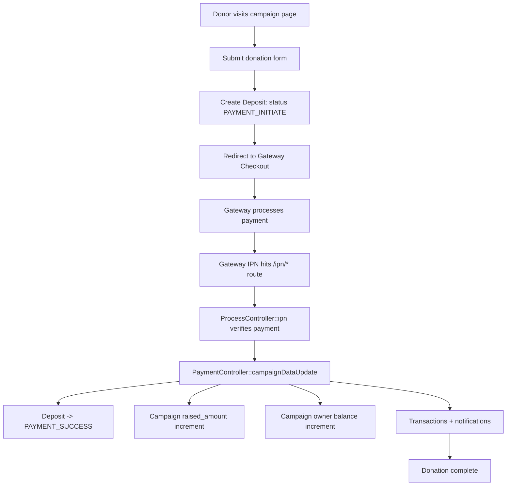
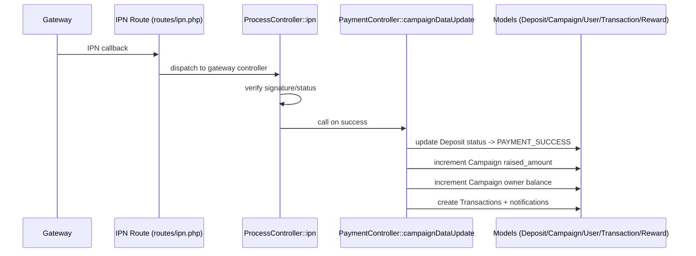
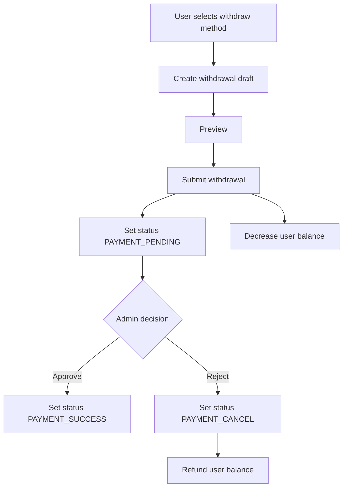
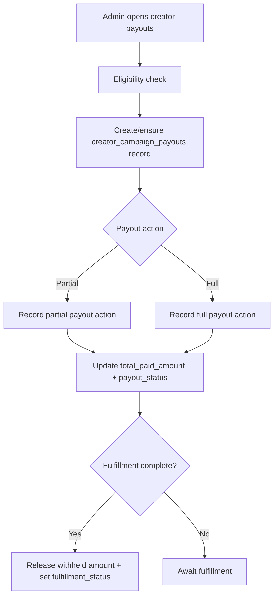

# ApnaCrowdfunding – Developer Documentation

## Step 1: User Signup Flow

This step documents the web user registration flow and the related API support endpoints that are wired to registration verification in the web area.

### Web signup routes and handlers

- Route file: `routes/user.php`
- HTTP method and URL: `GET /user/register`
- Route name: `user.register`
- Middleware applied: `web`, `maintenance`, `guest`
- Controller file path: `app/Http/Controllers/User/Auth/RegisterController.php`
- Class name: `App\Http\Controllers\User\Auth\RegisterController`
- Method name: `registerBusinessForm`
- Models used: none directly in this method
- Status changes: none
- Balance changes: none
- WHY this step exists: shows the registration page and country data to start a user signup
- What MUST NOT be changed (CRITICAL):
  - No critical money or status change here.

- Route file: `routes/user.php`
- HTTP method and URL: `GET /user/register-business`
- Route name: `user.register.business`
- Middleware applied: `web`, `maintenance`, `guest`
- Controller file path: `app/Http/Controllers/User/Auth/RegisterController.php`
- Class name: `App\Http\Controllers\User\Auth\RegisterController`
- Method name: `registerBusinessForm`
- Models used: none directly in this method
- Status changes: none
- Balance changes: none
- WHY this step exists: shows the business registration form that uses extra business fields
- What MUST NOT be changed (CRITICAL):
  - No critical money or status change here.

- Route file: `routes/user.php`
- HTTP method and URL: `POST /user/register`
- Route name: `user.register`
- Middleware applied: `web`, `maintenance`, `guest`, `register.status`
- Controller file path: `app/Http/Controllers/User/Auth/RegisterController.php`
- Class name: `App\Http\Controllers\User\Auth\RegisterController`
- Method name: `register`
- Models used: `App\Models\User`, `App\Models\AdminNotification`
- Status changes:
  - Sets user flags `kc`, `ec`, `sc`, `ts`, `tc` inside `create()` using `ManageStatus`.
- Balance changes: none
- WHY this step exists: validates input, creates a new user record, sends verification or welcome emails, and logs the new user in
- ⚠️ CRITICAL – MUST NOT BE CHANGED: this is a security and identity flow that creates real user accounts.
  - Do not remove `register.status` (registration availability check) because it blocks registration when signup is disabled.
  - Do not remove `verifyCaptcha()` checks because it is the first anti-bot barrier.
  - Do not change the initial verification status logic (`kc`, `ec`, `sc`, `tc`) because it controls authorization gates for all protected user routes.

- Route file: `routes/user.php`
- HTTP method and URL: `POST /user/register-business`
- Route name: `user.register.business`
- Middleware applied: `web`, `maintenance`, `guest`, `register.status`
- Controller file path: `app/Http/Controllers/User/Auth/RegisterController.php`
- Class name: `App\Http\Controllers\User\Auth\RegisterController`
- Method name: `registerBusiness`
- Models used: `App\Models\User`, `App\Models\AdminNotification`
- Status changes:
  - Sets user flags `kc`, `ec`, `sc`, `ts`, `tc` inside `createBusinessUser()` using `ManageStatus`.
- Balance changes: none
- WHY this step exists: supports the multi-step business signup UI by mapping fields and creating a user with business metadata
- ⚠️ CRITICAL – MUST NOT BE CHANGED: this is a security and identity flow that creates real user accounts.
  - Do not remove `register.status` (registration availability check) because it blocks registration when signup is disabled.
  - Do not change mapping of business fields because they are stored on the `users` table and are used later in admin review and onboarding.
  - Do not change initial verification status logic (`kc`, `ec`, `sc`, `tc`).

- Route file: `routes/user.php`
- HTTP method and URL: `POST /user/check-user`
- Route name: `user.check.user`
- Middleware applied: `web`, `maintenance`, `guest`
- Controller file path: `app/Http/Controllers/User/Auth/RegisterController.php`
- Class name: `App\Http\Controllers\User\Auth\RegisterController`
- Method name: `checkUser`
- Models used: `App\Models\User`
- Status changes: none
- Balance changes: none
- WHY this step exists: supports client-side uniqueness checks for email, mobile, and username
- What MUST NOT be changed (CRITICAL):
  - No critical money or status change here.

### Signup verification API endpoint (used by web route without CSRF)

- Route file: `routes/web.php`
- HTTP method and URL: `POST /api/verify-email`
- Route name: `api.verify.email`
- Middleware applied: `web`, `maintenance`
- Controller file path: `app/Http/Controllers/User/AuthorizationController.php`
- Class name: `App\Http\Controllers\User\AuthorizationController`
- Method name: `emailVerificationApi`
- Models used: `App\Models\User`
- Status changes:
  - Sets `users.ec` to `ManageStatus::VERIFIED`.
  - Clears `ver_code` and `ver_code_send_at`.
- Balance changes: none
- WHY this step exists: allows a logged-in user to verify email through API without CSRF (used by JS and mobile-style calls)
- ⚠️ CRITICAL – MUST NOT BE CHANGED: this is an email verification endpoint.
  - Do not remove verification code checks because it protects account ownership.

### WHY admin is excluded from user signup

- There is no admin registration route in `routes/admin.php`.
- Admin authentication uses the `admin` guard from `config/auth.php` and the `App\Models\Admin` model.
- Admin routes are behind `admin` middleware and are not accessible by normal users.
- This separation is enforced in `bootstrap/app.php` route grouping and in `App\Http\Middleware\RedirectIfNotAdmin` / `RedirectIfAdmin`.

## Step 2: User Login & Logout Flow

### Web login/logout routes and handlers

- Route file: `routes/user.php`
- HTTP method and URL: `GET /user/login`
- Route name: `user.login.form`
- Middleware applied: `web`, `maintenance`, `guest`
- Controller file path: `app/Http/Controllers/User/Auth/LoginController.php`
- Class name: `App\Http\Controllers\User\Auth\LoginController`
- Method name: `loginForm`
- Models used: none
- Status changes: none
- Balance changes: none
- WHY this step exists: shows the login form and login page content
- What MUST NOT be changed (CRITICAL):
  - No critical money or status change here.

- Route file: `routes/user.php`
- HTTP method and URL: `POST /user/login`
- Route name: `user.login`
- Middleware applied: `web`, `maintenance`, `guest`
- Controller file path: `app/Http/Controllers/User/Auth/LoginController.php`
- Class name: `App\Http\Controllers\User\Auth\LoginController`
- Method name: `login`
- Models used: `App\Models\User` (via auth guard)
- Status changes:
  - On success, `authenticated()` toggles `users.tc` based on `users.ts` in `LoginController::authenticated()`.
- Balance changes: none
- WHY this step exists: validates credentials, enforces CAPTCHA, throttles attempts, creates a session, and redirects to the user dashboard
- ⚠️ CRITICAL – MUST NOT BE CHANGED: this is a security flow.
  - Do not remove CAPTCHA and throttling logic, because it protects against brute force.
  - Do not change `findUsername()` behavior unless the UI no longer accepts email or username.

- Route file: `routes/user.php`
- HTTP method and URL: `GET /user/logout`
- Route name: `user.logout`
- Middleware applied: `web`, `maintenance`, `auth`
- Controller file path: `app/Http/Controllers/User/Auth/LoginController.php`
- Class name: `App\Http\Controllers\User\Auth\LoginController`
- Method name: `logout`
- Models used: none
- Status changes: none
- Balance changes: none
- WHY this step exists: clears the authenticated session and invalidates the current session
- ⚠️ CRITICAL – MUST NOT BE CHANGED: this is a security flow.
  - Do not remove session invalidation or guard logout.

### Mobile API login/logout (token-based)

- Route file: `routes/web.php` (API routes are defined here under `/api` prefix)
- HTTP method and URL: `GET|POST /api/user_login.php`
- Route name: none
- Middleware applied: `web`, `maintenance` (no `auth:sanctum` for login)
- Controller file path: `app/Http/Controllers/Api/AuthController.php`
- Class name: `App\Http\Controllers\Api\AuthController`
- Method name: `login`
- Models used: `App\Models\User`
- Status changes:
  - If legacy password format is detected (plain/MD5/SHA1), it upgrades and saves hashed password.
- Balance changes: none
- WHY this step exists: provides token-based login for mobile clients using `sanctum`
- ⚠️ CRITICAL – MUST NOT BE CHANGED: this is a security flow.
  - Do not remove password upgrade logic, because it supports legacy accounts.

## Step 3: Campaign Creation Flow

### Campaign creation routes and handlers

- Route file: `routes/user.php`
- HTTP method and URL: `GET /user/campaign/new`
- Route name: `user.campaign.create`
- Middleware applied: `web`, `maintenance`, `auth`, `authorize.status`
- Controller file path: `app/Http/Controllers/User/CampaignController.php`
- Class name: `App\Http\Controllers\User\CampaignController`
- Method name: `new`
- Models used: `App\Models\Category`
- Status changes: none
- Balance changes: none
- WHY this step exists: shows the campaign creation form with active categories
- What MUST NOT be changed (CRITICAL):
  - No critical money or status change here.

- Route file: `routes/user.php`
- HTTP method and URL: `POST /user/campaign/store`
- Route name: `user.campaign.store`
- Middleware applied: `web`, `maintenance`, `auth`, `authorize.status`
- Controller file path: `app/Http/Controllers/User/CampaignController.php`
- Class name: `App\Http\Controllers\User\CampaignController`
- Method name: `store`
- Models used: `App\Models\Campaign`, `App\Models\Category`, `App\Models\Gallery`, `App\Models\AdminNotification`, `App\Models\Admin`
- Status changes:
  - Sets `campaigns.status` to `ManageStatus::CAMPAIGN_PENDING`.
- Balance changes: none
- WHY this step exists: creates a new campaign record, stores images/video/gallery, and notifies admin for approval
- ⚠️ CRITICAL – MUST NOT BE CHANGED: this step sets initial campaign status and amount conversions.
  - Do not change the initial `CAMPAIGN_PENDING` status because the admin approval workflow depends on it.
  - Do not remove currency conversion fields (`goal_amount`, `goal_amount_usd`, `original_goal_amount`, `original_currency`, `exchange_rate_used`) because payout and reporting use these values.
  - Do not remove admin notifications and emails because they trigger campaign approval review.

### Initial campaign status and visibility rules

- Campaigns are created with `campaigns.status = ManageStatus::CAMPAIGN_PENDING`.
- Public listing and detail pages use `Campaign::approve()` which only returns `CAMPAIGN_APPROVED` campaigns.
- Therefore, a new campaign is not publicly visible until admin approval is completed.

## Step 4: Reward System Flow

### Reward management routes for creators

- Route file: `routes/user.php`
- HTTP method and URL: `GET /user/campaign/{slug}/rewards`
- Route name: `user.rewards.index`
- Middleware applied: `web`, `maintenance`, `auth`, `authorize.status`
- Controller file path: `app/Http/Controllers/User/RewardController.php`
- Class name: `App\Http\Controllers\User\RewardController`
- Method name: `index`
- Models used: `App\Models\Campaign`, `App\Models\Reward`
- Status changes: none
- Balance changes: none
- WHY this step exists: lists active rewards for a campaign that the creator can manage
- What MUST NOT be changed (CRITICAL):
  - No critical money or status change here.

- Route file: `routes/user.php`
- HTTP method and URL: `GET /user/campaign/{slug}/rewards/create`
- Route name: `user.rewards.create`
- Middleware applied: `web`, `maintenance`, `auth`, `authorize.status`
- Controller file path: `app/Http/Controllers/User/RewardController.php`
- Class name: `App\Http\Controllers\User\RewardController`
- Method name: `create`
- Models used: `App\Models\Campaign`
- Status changes: none
- Balance changes: none
- WHY this step exists: shows reward creation form for the creator
- What MUST NOT be changed (CRITICAL):
  - No critical money or status change here.

- Route file: `routes/user.php`
- HTTP method and URL: `POST /user/campaign/{slug}/rewards/store`
- Route name: `user.rewards.store`
- Middleware applied: `web`, `maintenance`, `auth`, `authorize.status`
- Controller file path: `app/Http/Controllers/User/RewardController.php`
- Class name: `App\Http\Controllers\User\RewardController`
- Method name: `store`
- Models used: `App\Models\Campaign`, `App\Models\Reward`
- Status changes: none (reward is created with default `is_active` value unless provided by model defaults)
- Balance changes: none
- WHY this step exists: validates and creates a reward with optional image upload and optional quantity limits
- ⚠️ CRITICAL – MUST NOT BE CHANGED: reward minimum amount and quantity are enforced by donations.
  - Do not remove validation on `minimum_amount` and `quantity` because donation eligibility relies on it.

- Route file: `routes/user.php`
- HTTP method and URL: `GET /user/campaign/{slug}/rewards/{rewardId}/edit`
- Route name: `user.rewards.edit`
- Middleware applied: `web`, `maintenance`, `auth`, `authorize.status`
- Controller file path: `app/Http/Controllers/User/RewardController.php`
- Class name: `App\Http\Controllers\User\RewardController`
- Method name: `edit`
- Models used: `App\Models\Campaign`, `App\Models\Reward`
- Status changes: none
- Balance changes: none
- WHY this step exists: allows editing of reward details and image
- What MUST NOT be changed (CRITICAL):
  - No critical money or status change here.

- Route file: `routes/user.php`
- HTTP method and URL: `POST /user/campaign/{slug}/rewards/{rewardId}/update`
- Route name: `user.rewards.update`
- Middleware applied: `web`, `maintenance`, `auth`, `authorize.status`
- Controller file path: `app/Http/Controllers/User/RewardController.php`
- Class name: `App\Http\Controllers\User\RewardController`
- Method name: `update`
- Models used: `App\Models\Campaign`, `App\Models\Reward`
- Status changes: none
- Balance changes: none
- WHY this step exists: updates reward fields and optional image
- ⚠️ CRITICAL – MUST NOT BE CHANGED: reward minimum amount and quantity are enforced by donations.
  - Do not remove validation or update of `minimum_amount`/`quantity`.

- Route file: `routes/user.php`
- HTTP method and URL: `DELETE /user/campaign/{slug}/rewards/{rewardId}`
- Route name: `user.rewards.destroy`
- Middleware applied: `web`, `maintenance`, `auth`, `authorize.status`
- Controller file path: `app/Http/Controllers/User/RewardController.php`
- Class name: `App\Http\Controllers\User\RewardController`
- Method name: `destroy`
- Models used: `App\Models\Campaign`, `App\Models\Reward`
- Status changes: reward record deleted
- Balance changes: none
- WHY this step exists: allows creator to remove reward options
- ⚠️ CRITICAL – MUST NOT BE CHANGED: deleting rewards affects claim tracking.
  - Do not delete rewards that have existing claims without a safe migration or policy.

- Route file: `routes/user.php`
- HTTP method and URL: `POST /user/campaign/{slug}/rewards/{rewardId}/toggle-status`
- Route name: `user.rewards.toggle.status`
- Middleware applied: `web`, `maintenance`, `auth`, `authorize.status`
- Controller file path: `app/Http/Controllers/User/RewardController.php`
- Class name: `App\Http\Controllers\User\RewardController`
- Method name: `toggleStatus`
- Models used: `App\Models\Campaign`, `App\Models\Reward`
- Status changes: toggles `rewards.is_active`
- Balance changes: none
- WHY this step exists: allows temporarily disabling reward options without deleting
- ⚠️ CRITICAL – MUST NOT BE CHANGED: this controls reward availability for donations.

### Reward claim increment during donation

- Route file: `routes/user.php` (via donation flow)
- HTTP method and URL: `POST /user/deposit/insert/{slug}` then IPN success
- Route name: `user.deposit.insert` (success handled in gateway IPN)
- Middleware applied: `web`, `maintenance` for the insert request; IPN uses `web`, `maintenance` with CSRF exception
- Controller file path: `app/Http/Controllers/Gateway/PaymentController.php`
- Class name: `App\Http\Controllers\Gateway\PaymentController`
- Method name: `campaignDataUpdate`
- Models used: `App\Models\Reward`
- Status changes: none on reward record, but `reward.claimed_count` increments when a donation succeeds
- Balance changes: none directly for reward, but donation updates balances (see Step 5 and Step 8)
- WHY this step exists: tracks reward claims to enforce limited quantities
- ⚠️ CRITICAL – MUST NOT BE CHANGED: reward claim count is used to prevent over-claiming.

### Reward fulfillment tracking by creator

- Route file: `routes/user.php`
- HTTP method and URL: `POST /user/reward/fulfill`
- Route name: `user.reward.fulfill`
- Middleware applied: `web`, `maintenance`, `auth`, `authorize.status`
- Controller file path: `app/Http/Controllers/User/UserController.php`
- Class name: `App\Http\Controllers\User\UserController`
- Method name: `fulfillReward`
- Models used: `App\Models\Transaction`, `App\Models\Deposit`
- Status changes:
  - Sets `transactions.reward_fulfilled = true` (if column exists)
  - Sets `transactions.reward_fulfilled_at` and `transactions.reward_fulfillment_note` (if columns exist)
- Balance changes: none
- WHY this step exists: allows creators to mark rewards as fulfilled for reward-based contributions
- ⚠️ CRITICAL – MUST NOT BE CHANGED: this is a fulfillment audit flag.

## Step 5: Web Fund Contribution Flow

This step documents the web donation flow that uses the gateway system and IPN callbacks.

### Public contribution page (donation UI)

- Route file: `routes/web.php`
- HTTP method and URL: `GET /campaign/{slug}/contribute`
- Route name: `campaign.donate`
- Middleware applied: `web`, `maintenance`, `BetaGate`
- Controller file path: `app/Http/Controllers/WebsiteController.php`
- Class name: `App\Http\Controllers\WebsiteController`
- Method name: `campaignDonate`
- Models used: `App\Models\Campaign`, `App\Models\GatewayCurrency`
- Status changes: none
- Balance changes: none
- WHY this step exists: shows the donation form and loads available gateways for an approved campaign
- What MUST NOT be changed (CRITICAL):
  - No critical money or status change here.

### Donation initiation and confirmation

- Route file: `routes/user.php`
- HTTP method and URL: `POST /user/deposit/insert/{slug}`
- Route name: `user.deposit.insert`
- Middleware applied: `web`, `maintenance`
- Controller file path: `app/Http/Controllers/Gateway/PaymentController.php`
- Class name: `App\Http\Controllers\Gateway\PaymentController`
- Method name: `depositInserts`
- Models used: `App\Models\Campaign`, `App\Models\Deposit`, `App\Models\GatewayCurrency`, `App\Models\Reward`
- Status changes:
  - `deposits.status` is not explicitly set here; it uses the database default.
- Balance changes: none at this step
- WHY this step exists: validates donor input, validates reward availability, selects gateway and creates a pending donation record
- ⚠️ CRITICAL – MUST NOT BE CHANGED: this step controls how donation amounts are converted and validated.
  - Do not remove min/max checks from `GatewayCurrency` because it prevents invalid payment amounts.
  - Do not remove reward checks (`minimum_amount`, `isAvailable`) because it enforces reward limits.

- Route file: `routes/user.php`
- HTTP method and URL: `GET /user/deposit/confirm`
- Route name: `user.deposit.confirm`
- Middleware applied: `web`, `maintenance`
- Controller file path: `app/Http/Controllers/Gateway/PaymentController.php`
- Class name: `App\Http\Controllers\Gateway\PaymentController`
- Method name: `depositConfirm`
- Models used: `App\Models\Deposit`
- Status changes: none in this method
- Balance changes: none in this method
- WHY this step exists: loads the correct gateway ProcessController and renders the payment page or redirects
- ⚠️ CRITICAL – MUST NOT BE CHANGED: this step routes to the correct payment gateway handler.
  - Do not change the `alias` based ProcessController resolution without updating gateway naming and IPN handling.

- Route file: `routes/user.php`
- HTTP method and URL: `GET /user/deposit/success`
- Route name: `user.deposit.success`
- Middleware applied: `web`, `maintenance`
- Controller file path: `app/Http/Controllers/Gateway/PaymentController.php`
- Class name: `App\Http\Controllers\Gateway\PaymentController`
- Method name: `success`
- Models used: `App\Models\Deposit`
- Status changes: none in this method
- Balance changes: none in this method
- WHY this step exists: shows the success message after a completed donation
- What MUST NOT be changed (CRITICAL):
  - No critical money or status change here.

### IPN and payment success handling

All payment gateways call their own ProcessController `ipn()` method from `routes/ipn.php`. Successful payments call `PaymentController::campaignDataUpdate()`.

- Route file: `routes/ipn.php`
- HTTP method and URL: `POST /ipn/authorize`
- Route name: `ipn.Authorize`
- Middleware applied: `web`, `maintenance`, CSRF exception for `ipn*`
- Controller file path: `app/Http/Controllers/Gateway/Authorize/ProcessController.php`
- Class name: `App\Http\Controllers\Gateway\Authorize\ProcessController`
- Method name: `ipn`
- Models used: `App\Models\Deposit`
- Status changes: calls `PaymentController::campaignDataUpdate()` on success
- Balance changes: handled inside `campaignDataUpdate()`
- WHY this step exists: completes payment for Authorize.net gateway
- ⚠️ CRITICAL – MUST NOT BE CHANGED: payment verification and status changes occur here.

- Route file: `routes/ipn.php`
- HTTP method and URL: `ANY /ipn/btc-pay`
- Route name: `ipn.BTCPay`
- Middleware applied: `web`, `maintenance`, CSRF exception for `ipn*`
- Controller file path: `app/Http/Controllers/Gateway/BTCPay/ProcessController.php`
- Class name: `App\Http\Controllers\Gateway\BTCPay\ProcessController`
- Method name: `ipn`
- Models used: `App\Models\Deposit`
- Status changes: calls `PaymentController::campaignDataUpdate()` on success
- Balance changes: handled inside `campaignDataUpdate()`
- WHY this step exists: completes payment for BTCPay gateway
- ⚠️ CRITICAL – MUST NOT BE CHANGED: payment verification and status changes occur here.

- Route file: `routes/ipn.php`
- HTTP method and URL: `ANY /ipn/checkout`
- Route name: `ipn.Checkout`
- Middleware applied: `web`, `maintenance`, CSRF exception for `ipn*`
- Controller file path: `app/Http/Controllers/Gateway/Checkout/ProcessController.php`
- Class name: `App\Http\Controllers\Gateway\Checkout\ProcessController`
- Method name: `ipn`
- Models used: `App\Models\Deposit`
- Status changes: calls `PaymentController::campaignDataUpdate()` on success
- Balance changes: handled inside `campaignDataUpdate()`
- WHY this step exists: completes payment for Checkout gateway
- ⚠️ CRITICAL – MUST NOT BE CHANGED: payment verification and status changes occur here.

- Route file: `routes/ipn.php`
- HTTP method and URL: `POST /ipn/coinbase-commerce`
- Route name: `ipn.CoinbaseCommerce`
- Middleware applied: `web`, `maintenance`, CSRF exception for `ipn*`
- Controller file path: `app/Http/Controllers/Gateway/CoinbaseCommerce/ProcessController.php`
- Class name: `App\Http\Controllers\Gateway\CoinbaseCommerce\ProcessController`
- Method name: `ipn`
- Models used: `App\Models\Deposit`
- Status changes: calls `PaymentController::campaignDataUpdate()` on success
- Balance changes: handled inside `campaignDataUpdate()`
- WHY this step exists: completes payment for Coinbase Commerce gateway
- ⚠️ CRITICAL – MUST NOT BE CHANGED: payment verification and status changes occur here.

- Route file: `routes/ipn.php`
- HTTP method and URL: `POST /ipn/coinpayments`
- Route name: `ipn.Coinpayments`
- Middleware applied: `web`, `maintenance`, CSRF exception for `ipn*`
- Controller file path: `app/Http/Controllers/Gateway/Coinpayments/ProcessController.php`
- Class name: `App\Http\Controllers\Gateway\Coinpayments\ProcessController`
- Method name: `ipn`
- Models used: `App\Models\Deposit`
- Status changes: calls `PaymentController::campaignDataUpdate()` on success
- Balance changes: handled inside `campaignDataUpdate()`
- WHY this step exists: completes payment for Coinpayments gateway
- ⚠️ CRITICAL – MUST NOT BE CHANGED: payment verification and status changes occur here.

- Route file: `routes/ipn.php`
- HTTP method and URL: `GET /ipn/flutterwave/{trx}/{type}`
- Route name: `ipn.Flutterwave`
- Middleware applied: `web`, `maintenance`, CSRF exception for `ipn*`
- Controller file path: `app/Http/Controllers/Gateway/Flutterwave/ProcessController.php`
- Class name: `App\Http\Controllers\Gateway\Flutterwave\ProcessController`
- Method name: `ipn`
- Models used: `App\Models\Deposit`
- Status changes: calls `PaymentController::campaignDataUpdate()` on success
- Balance changes: handled inside `campaignDataUpdate()`
- WHY this step exists: completes payment for Flutterwave gateway
- ⚠️ CRITICAL – MUST NOT BE CHANGED: payment verification and status changes occur here.

- Route file: `routes/ipn.php`
- HTTP method and URL: `POST /ipn/mercado-pago`
- Route name: `ipn.MercadoPago`
- Middleware applied: `web`, `maintenance`, CSRF exception for `ipn*`
- Controller file path: `app/Http/Controllers/Gateway/MercadoPago/ProcessController.php`
- Class name: `App\Http\Controllers\Gateway\MercadoPago\ProcessController`
- Method name: `ipn`
- Models used: `App\Models\Deposit`
- Status changes: calls `PaymentController::campaignDataUpdate()` on success
- Balance changes: handled inside `campaignDataUpdate()`
- WHY this step exists: completes payment for MercadoPago gateway
- ⚠️ CRITICAL – MUST NOT BE CHANGED: payment verification and status changes occur here.

- Route file: `routes/ipn.php`
- HTTP method and URL: `POST /ipn/now-payments-checkout`
- Route name: `ipn.NowPaymentsCheckout`
- Middleware applied: `web`, `maintenance`, CSRF exception for `ipn*`
- Controller file path: `app/Http/Controllers/Gateway/NowPaymentsCheckout/ProcessController.php`
- Class name: `App\Http\Controllers\Gateway\NowPaymentsCheckout\ProcessController`
- Method name: `ipn`
- Models used: `App\Models\Deposit`
- Status changes: calls `PaymentController::campaignDataUpdate()` on success
- Balance changes: handled inside `campaignDataUpdate()`
- WHY this step exists: completes payment for NowPayments Checkout gateway
- ⚠️ CRITICAL – MUST NOT BE CHANGED: payment verification and status changes occur here.

- Route file: `routes/ipn.php`
- HTTP method and URL: `POST /ipn/payeer`
- Route name: `ipn.Payeer`
- Middleware applied: `web`, `maintenance`, CSRF exception for `ipn*`
- Controller file path: `app/Http/Controllers/Gateway/Payeer/ProcessController.php`
- Class name: `App\Http\Controllers\Gateway\Payeer\ProcessController`
- Method name: `ipn`
- Models used: `App\Models\Deposit`
- Status changes: calls `PaymentController::campaignDataUpdate()` on success
- Balance changes: handled inside `campaignDataUpdate()`
- WHY this step exists: completes payment for Payeer gateway
- ⚠️ CRITICAL – MUST NOT BE CHANGED: payment verification and status changes occur here.

- Route file: `routes/ipn.php`
- HTTP method and URL: `GET /ipn/paypal-sdk`
- Route name: `ipn.PaypalSdk`
- Middleware applied: `web`, `maintenance`, CSRF exception for `ipn*`
- Controller file path: `app/Http/Controllers/Gateway/PaypalSdk/ProcessController.php`
- Class name: `App\Http\Controllers\Gateway\PaypalSdk\ProcessController`
- Method name: `ipn`
- Models used: `App\Models\Deposit`
- Status changes: calls `PaymentController::campaignDataUpdate()` on success
- Balance changes: handled inside `campaignDataUpdate()`
- WHY this step exists: completes payment for PayPal SDK gateway
- ⚠️ CRITICAL – MUST NOT BE CHANGED: payment verification and status changes occur here.

- Route file: `routes/ipn.php`
- HTTP method and URL: `POST /ipn/paystack`
- Route name: `ipn.Paystack`
- Middleware applied: `web`, `maintenance`, CSRF exception for `ipn*`
- Controller file path: `app/Http/Controllers/Gateway/Paystack/ProcessController.php`
- Class name: `App\Http\Controllers\Gateway\Paystack\ProcessController`
- Method name: `ipn`
- Models used: `App\Models\Deposit`
- Status changes: calls `PaymentController::campaignDataUpdate()` on success
- Balance changes: handled inside `campaignDataUpdate()`
- WHY this step exists: completes payment for Paystack gateway
- ⚠️ CRITICAL – MUST NOT BE CHANGED: payment verification and status changes occur here.

- Route file: `routes/ipn.php`
- HTTP method and URL: `POST /ipn/perfect-money`
- Route name: `ipn.PerfectMoney`
- Middleware applied: `web`, `maintenance`, CSRF exception for `ipn*`
- Controller file path: `app/Http/Controllers/Gateway/PerfectMoney/ProcessController.php`
- Class name: `App\Http\Controllers\Gateway\PerfectMoney\ProcessController`
- Method name: `ipn`
- Models used: `App\Models\Deposit`
- Status changes: calls `PaymentController::campaignDataUpdate()` on success
- Balance changes: handled inside `campaignDataUpdate()`
- WHY this step exists: completes payment for PerfectMoney gateway
- ⚠️ CRITICAL – MUST NOT BE CHANGED: payment verification and status changes occur here.

- Route file: `routes/ipn.php`
- HTTP method and URL: `POST /ipn/razorpay`
- Route name: `ipn.Razorpay`
- Middleware applied: `web`, `maintenance`, CSRF exception for `ipn*`
- Controller file path: `app/Http/Controllers/Gateway/Razorpay/ProcessController.php`
- Class name: `App\Http\Controllers\Gateway\Razorpay\ProcessController`
- Method name: `ipn`
- Models used: `App\Models\Deposit`
- Status changes: calls `PaymentController::campaignDataUpdate()` on success
- Balance changes: handled inside `campaignDataUpdate()`
- WHY this step exists: completes payment for Razorpay gateway
- ⚠️ CRITICAL – MUST NOT BE CHANGED: payment verification and status changes occur here.

- Route file: `routes/ipn.php`
- HTTP method and URL: `POST /ipn/stripe-v3`
- Route name: `ipn.StripeV3`
- Middleware applied: `web`, `maintenance`, CSRF exception for `ipn*`
- Controller file path: `app/Http/Controllers/Gateway/StripeV3/ProcessController.php`
- Class name: `App\Http\Controllers\Gateway\StripeV3\ProcessController`
- Method name: `ipn`
- Models used: `App\Models\Deposit`
- Status changes: calls `PaymentController::campaignDataUpdate()` on success
- Balance changes: handled inside `campaignDataUpdate()`
- WHY this step exists: completes payment for Stripe V3 gateway
- ⚠️ CRITICAL – MUST NOT BE CHANGED: payment verification and status changes occur here.

- Route file: `routes/ipn.php`
- HTTP method and URL: `POST /ipn/2checkout`
- Route name: `ipn.TwoCheckout`
- Middleware applied: `web`, `maintenance`, CSRF exception for `ipn*`
- Controller file path: `app/Http/Controllers/Gateway/TwoCheckout/ProcessController.php`
- Class name: `App\Http\Controllers\Gateway\TwoCheckout\ProcessController`
- Method name: `ipn`
- Models used: `App\Models\Deposit`
- Status changes: calls `PaymentController::campaignDataUpdate()` on success
- Balance changes: handled inside `campaignDataUpdate()`
- WHY this step exists: completes payment for 2Checkout gateway
- ⚠️ CRITICAL – MUST NOT BE CHANGED: payment verification and status changes occur here.

- Route file: `routes/ipn.php`
- HTTP method and URL: `POST /ipn/stripe-js`
- Route name: `ipn.StripeJs`
- Middleware applied: `web`, `maintenance`, CSRF exception for `ipn*`
- Controller file path: `app/Http/Controllers/Gateway/StripeJs/ProcessController.php`
- Class name: `App\Http\Controllers\Gateway\StripeJs\ProcessController`
- Method name: `ipn`
- Models used: `App\Models\Deposit`
- Status changes: calls `PaymentController::campaignDataUpdate()` on success
- Balance changes: handled inside `campaignDataUpdate()`
- WHY this step exists: completes payment for Stripe JS gateway
- ⚠️ CRITICAL – MUST NOT BE CHANGED: payment verification and status changes occur here.

- Route file: `routes/ipn.php`
- HTTP method and URL: `POST /ipn/card-payment`
- Route name: `ipn.CardPayment`
- Middleware applied: `web`, `maintenance`, CSRF exception for `ipn*`
- Controller file path: `app/Http/Controllers/Gateway/CardPayment/ProcessController.php`
- Class name: `App\Http\Controllers\Gateway\CardPayment\ProcessController`
- Method name: `ipn`
- Models used: `App\Models\Deposit`
- Status changes: calls `PaymentController::campaignDataUpdate()` on success
- Balance changes: handled inside `campaignDataUpdate()`
- WHY this step exists: completes payment for Card Payment gateway
- ⚠️ CRITICAL – MUST NOT BE CHANGED: payment verification and status changes occur here.

- Route file: `routes/ipn.php`
- HTTP method and URL: `POST /ipn/mwallet`
- Route name: `ipn.MWallet`
- Middleware applied: `web`, `maintenance`, CSRF exception for `ipn*`
- Controller file path: `app/Http/Controllers/Gateway/MWallet/ProcessController.php`
- Class name: `App\Http\Controllers\Gateway\MWallet\ProcessController`
- Method name: `ipn`
- Models used: `App\Models\Deposit`
- Status changes: calls `PaymentController::campaignDataUpdate()` on success
- Balance changes: handled inside `campaignDataUpdate()`
- WHY this step exists: completes payment for MWallet gateway
- ⚠️ CRITICAL – MUST NOT BE CHANGED: payment verification and status changes occur here.

- Route file: `routes/ipn.php`
- HTTP method and URL: `POST /ipn/jazzcash-wallet`
- Route name: `ipn.JazzCashWallet`
- Middleware applied: `web`, `maintenance`, CSRF exception for `ipn*`
- Controller file path: `app/Http/Controllers/Gateway/JazzCashWallet/ProcessController.php`
- Class name: `App\Http\Controllers\Gateway\JazzCashWallet\ProcessController`
- Method name: `ipn`
- Models used: `App\Models\Deposit`
- Status changes:
  - Can set `deposits.status` to `PAYMENT_PENDING` and then call `campaignDataUpdate()` on success.
- Balance changes: handled inside `campaignDataUpdate()`
- WHY this step exists: completes payment for JazzCash Wallet gateway
- ⚠️ CRITICAL – MUST NOT BE CHANGED: payment verification and status changes occur here.

### Campaign and balance updates on successful payment

- Route file: `routes/ipn.php` (called from many gateway IPNs)
- HTTP method and URL: depends on gateway IPN route
- Route name: depends on gateway IPN route
- Middleware applied: `web`, `maintenance`, CSRF exception for `ipn*`
- Controller file path: `app/Http/Controllers/Gateway/PaymentController.php`
- Class name: `App\Http\Controllers\Gateway\PaymentController`
- Method name: `campaignDataUpdate`
- Models used: `App\Models\Deposit`, `App\Models\Campaign`, `App\Models\Reward`, `App\Models\User`, `App\Models\Transaction`, `App\Models\AdminNotification`
- Status changes:
  - Changes `deposits.status` from `PAYMENT_INITIATE` or `PAYMENT_PENDING` to `PAYMENT_SUCCESS`.
  - Increments `campaigns.raised_amount` by deposit amount.
  - Increments `rewards.claimed_count` when a reward is used and `quantity` is not null.
- Balance changes:
  - Adds deposit amount to `campaign owner` balance.
- WHY this step exists: finalizes donation, updates totals, creates donor/receiver transactions, and sends notifications
- ⚠️ CRITICAL – MUST NOT BE CHANGED: this is the core money movement logic.
  - Do not change status transition logic because it prevents double-crediting.
  - Do not remove balance updates and transaction creation because audit trails and payout logic depend on them.

### Additional JazzCash IPN endpoint (defined in web routes)

- Route file: `routes/web.php`
- HTTP method and URL: `ANY /jazzcash/ipn`
- Route name: `jazzcash.ipn`
- Middleware applied: `web`, `maintenance`, CSRF exception for `jazzcash/ipn`
- Controller file path: `app/Http/Controllers/Gateway/JazzCash/IpnController.php`
- Class name: `App\Http\Controllers\Gateway\JazzCash\IpnController`
- Method name: `handle`
- Models used: `App\Models\Deposit`
- Status changes: calls `PaymentController::campaignDataUpdate()` on success
- Balance changes: handled inside `campaignDataUpdate()`
- WHY this step exists: provides a JazzCash IPN endpoint outside the `ipn` prefix
- ⚠️ CRITICAL – MUST NOT BE CHANGED: payment verification and status changes occur here.

## Step 6: Manual Fund Contribution Flow

### Manual donation confirmation and submission

- Route file: `routes/user.php`
- HTTP method and URL: `GET /user/deposit/manual`
- Route name: `user.deposit.manual.confirm`
- Middleware applied: `web`, `maintenance`
- Controller file path: `app/Http/Controllers/Gateway/PaymentController.php`
- Class name: `App\Http\Controllers\Gateway\PaymentController`
- Method name: `manualDepositConfirm`
- Models used: `App\Models\Deposit`
- Status changes: none in this method
- Balance changes: none in this method
- WHY this step exists: renders the manual gateway instructions form for the pending deposit
- ⚠️ CRITICAL – MUST NOT BE CHANGED: manual gateway details are required for admin review.

- Route file: `routes/user.php`
- HTTP method and URL: `POST /user/deposit/manual`
- Route name: `user.deposit.manual.update`
- Middleware applied: `web`, `maintenance`
- Controller file path: `app/Http/Controllers/Gateway/PaymentController.php`
- Class name: `App\Http\Controllers\Gateway\PaymentController`
- Method name: `manualDepositUpdate`
- Models used: `App\Models\Deposit`, `App\Models\AdminNotification`
- Status changes:
  - Sets `deposits.status` to `ManageStatus::PAYMENT_PENDING`.
- Balance changes: none at this step
- WHY this step exists: saves user-provided manual payment proof and sends admin notification
- ⚠️ CRITICAL – MUST NOT BE CHANGED: this step marks deposit as pending for manual review.

### Admin approval and rejection of manual donations

- Route file: `routes/admin.php`
- HTTP method and URL: `POST /admin/donations/approve/{id}`
- Route name: `admin.donations.approve`
- Middleware applied: `web`, `admin`
- Controller file path: `app/Http/Controllers/Admin/DepositController.php`
- Class name: `App\Http\Controllers\Admin\DepositController`
- Method name: `approve`
- Models used: `App\Models\Deposit`, `App\Models\Campaign`, `App\Models\User`, `App\Models\Transaction` (inside `campaignDataUpdate`)
- Status changes:
  - Changes `deposits.status` to `ManageStatus::PAYMENT_SUCCESS` via `PaymentController::campaignDataUpdate()`.
- Balance changes:
  - Adds deposit amount to campaign owner balance (inside `campaignDataUpdate`).
- WHY this step exists: allows admin to validate manual payment and credit the campaign
- ⚠️ CRITICAL – MUST NOT BE CHANGED: this is a money movement approval step.

- Route file: `routes/admin.php`
- HTTP method and URL: `POST /admin/donations/reject/{id}`
- Route name: `admin.donations.reject`
- Middleware applied: `web`, `admin`
- Controller file path: `app/Http/Controllers/Admin/DepositController.php`
- Class name: `App\Http\Controllers\Admin\DepositController`
- Method name: `reject`
- Models used: `App\Models\Deposit`, `App\Models\User`, `App\Models\Campaign`
- Status changes:
  - Sets `deposits.status` to `ManageStatus::PAYMENT_CANCEL`.
- Balance changes: none
- WHY this step exists: allows admin to reject invalid manual payment proofs
- ⚠️ CRITICAL – MUST NOT BE CHANGED: rejection must keep deposit from being credited.

## Step 7: API Fund Contribution Flow

### Mobile API donation endpoint

- Route file: `routes/web.php`
- HTTP method and URL: `GET|POST /api/donate_now.php`
- Route name: none
- Middleware applied: `web`, `maintenance`, `auth:sanctum`
- Controller file path: `app/Http/Controllers/Api/DonateController.php`
- Class name: `App\Http\Controllers\Api\DonateController`
- Method name: `donateNow`
- Models used: `App\Models\User` (via raw SQL), `App\Models\Campaign` (via raw SQL), `App\Models\Deposit` (via raw SQL), `App\Services\CurrencyService`
- Status changes:
  - Inserts `deposits.status = 1` (payment success) for API donations.
  - Can update `campaigns.status = 1` when remaining amount is zero or below.
- Balance changes:
  - Deducts wallet balance when `wall_amt` is used.
  - Credits wallet balance when donation exceeds remaining goal (refund logic).
- WHY this step exists: supports mobile donation with optional wallet use and direct deposit insertion
- ⚠️ CRITICAL – MUST NOT BE CHANGED: this path changes money and campaign status.
  - Do not remove remaining-amount checks; it prevents over-funding.
  - Do not remove wallet refund logic because it corrects overpayments.
  - Do not remove wallet deduction logic because it enforces wallet usage amounts.

### API wallet refund logic on overfunding

- Route file: `routes/web.php`
- HTTP method and URL: `GET|POST /api/donate_now.php`
- Route name: none
- Middleware applied: `web`, `maintenance`, `auth:sanctum`
- Controller file path: `app/Http/Controllers/Api/DonateController.php`
- Class name: `App\Http\Controllers\Api\DonateController`
- Method name: `donateNow`
- Models used: `users`, `wallet_report` tables via raw SQL
- Status changes:
  - Updates `campaigns.status` to `1` when campaign is already completed.
- Balance changes:
  - Increases `users.balance` when refunding the amount.
- WHY this step exists: prevents overfunding and returns excess to the donor wallet
- ⚠️ CRITICAL – MUST NOT BE CHANGED: this is a money refund flow.

## Step 8: Transaction & Balance Logic

(Only balance changes are documented here.)

- Route file: `routes/ipn.php` and `routes/web.php` (gateway IPN endpoints)
- HTTP method and URL: varies by gateway IPN
- Route name: varies by gateway IPN
- Middleware applied: `web`, `maintenance`, CSRF exception for `ipn*` and `jazzcash/ipn`
- Controller file path: `app/Http/Controllers/Gateway/PaymentController.php`
- Class name: `App\Http\Controllers\Gateway\PaymentController`
- Method name: `campaignDataUpdate`
- Models used: `App\Models\Deposit`, `App\Models\Campaign`, `App\Models\User`, `App\Models\Transaction`
- Status changes:
  - `deposits.status` to `PAYMENT_SUCCESS`.
- Balance changes:
  - Adds `deposit.amount` to campaign owner `users.balance`.
- WHY this step exists: credits the campaign owner on successful donation
- ⚠️ CRITICAL – MUST NOT BE CHANGED: core money credit logic for campaign owners.

- Route file: `routes/user.php`
- HTTP method and URL: `POST /user/withdraw/preview`
- Route name: none (route not named)
- Middleware applied: `web`, `maintenance`, `auth`, `authorize.status`, `kyc.status`
- Controller file path: `app/Http/Controllers/User/WithdrawController.php`
- Class name: `App\Http\Controllers\User\WithdrawController`
- Method name: `submit`
- Models used: `App\Models\Withdrawal`, `App\Models\User`, `App\Models\Transaction`
- Status changes:
  - `withdrawals.status` to `PAYMENT_PENDING`.
- Balance changes:
  - Subtracts `withdrawals.amount` from `users.balance`.
- WHY this step exists: reserves user funds during a withdrawal request
- ⚠️ CRITICAL – MUST NOT BE CHANGED: this is a money debit operation.

- Route file: `routes/admin.php`
- HTTP method and URL: `POST /admin/withdraw/cancel`
- Route name: `admin.withdraw.cancel`
- Middleware applied: `web`, `admin`
- Controller file path: `app/Http/Controllers/Admin/WithdrawController.php`
- Class name: `App\Http\Controllers\Admin\WithdrawController`
- Method name: `cancel`
- Models used: `App\Models\Withdrawal`, `App\Models\User`, `App\Models\Transaction`
- Status changes:
  - `withdrawals.status` to `PAYMENT_CANCEL`.
- Balance changes:
  - Adds `withdrawals.amount` back to `users.balance`.
- WHY this step exists: refunds a rejected withdrawal back to user balance
- ⚠️ CRITICAL – MUST NOT BE CHANGED: this is a money refund operation.

- Route file: `routes/admin.php`
- HTTP method and URL: `POST /admin/user/balance-update/{id}`
- Route name: `admin.user.add.sub.balance`
- Middleware applied: `web`, `admin`
- Controller file path: `app/Http/Controllers/Admin/UserController.php`
- Class name: `App\Http\Controllers\Admin\UserController`
- Method name: `balanceUpdate`
- Models used: `App\Models\User`, `App\Models\Transaction`
- Status changes: none
- Balance changes:
  - Adds or subtracts `amount` to/from `users.balance` based on `act` value.
- WHY this step exists: allows admin to manually adjust user balances
- ⚠️ CRITICAL – MUST NOT BE CHANGED: this is a direct balance manipulation tool.

- Route file: `routes/web.php`
- HTTP method and URL: `GET|POST /api/donate_now.php`
- Route name: none
- Middleware applied: `web`, `maintenance`, `auth:sanctum`
- Controller file path: `app/Http/Controllers/Api/DonateController.php`
- Class name: `App\Http\Controllers\Api\DonateController`
- Method name: `donateNow`
- Models used: `users` and `wallet_report` tables via raw SQL
- Status changes:
  - Inserts deposits with `status = 1` for successful API donations.
- Balance changes:
  - Decreases `users.balance` when wallet is used (`wall_amt`).
  - Increases `users.balance` when refunding overfunding amount.
- WHY this step exists: handles mobile wallet debits and refunds
- ⚠️ CRITICAL – MUST NOT BE CHANGED: this path changes money.

## Step 9: Withdrawal Flow

### User withdrawal request (web)

- Route file: `routes/user.php`
- HTTP method and URL: `GET /user/withdraw`
- Route name: `user.withdraw.methods`
- Middleware applied: `web`, `maintenance`, `auth`, `authorize.status`, `kyc.status`
- Controller file path: `app/Http/Controllers/User/WithdrawController.php`
- Class name: `App\Http\Controllers\User\WithdrawController`
- Method name: `methods`
- Models used: `App\Models\WithdrawMethod`
- Status changes: none
- Balance changes: none
- WHY this step exists: shows available withdrawal methods to a KYC-verified user
- ⚠️ CRITICAL – MUST NOT BE CHANGED: access is restricted by KYC.

- Route file: `routes/user.php`
- HTTP method and URL: `POST /user/withdraw`
- Route name: none (route not named)
- Middleware applied: `web`, `maintenance`, `auth`, `authorize.status`, `kyc.status`
- Controller file path: `app/Http/Controllers/User/WithdrawController.php`
- Class name: `App\Http\Controllers\User\WithdrawController`
- Method name: `store`
- Models used: `App\Models\WithdrawMethod`, `App\Models\Withdrawal`
- Status changes:
  - Creates `withdrawals` record with default status (not explicitly set here).
- Balance changes: none at this step
- WHY this step exists: creates a withdrawal request draft and saves amount and method
- ⚠️ CRITICAL – MUST NOT BE CHANGED: amounts and limits protect funds.

- Route file: `routes/user.php`
- HTTP method and URL: `GET /user/withdraw/preview`
- Route name: `user.withdraw.preview`
- Middleware applied: `web`, `maintenance`, `auth`, `authorize.status`, `kyc.status`
- Controller file path: `app/Http/Controllers/User/WithdrawController.php`
- Class name: `App\Http\Controllers\User\WithdrawController`
- Method name: `preview`
- Models used: `App\Models\Withdrawal`
- Status changes: none
- Balance changes: none
- WHY this step exists: shows withdrawal confirmation details before final submit
- What MUST NOT be changed (CRITICAL):
  - No critical money or status change here.

- Route file: `routes/user.php`
- HTTP method and URL: `POST /user/withdraw/preview`
- Route name: none (route not named)
- Middleware applied: `web`, `maintenance`, `auth`, `authorize.status`, `kyc.status`
- Controller file path: `app/Http/Controllers/User/WithdrawController.php`
- Class name: `App\Http\Controllers\User\WithdrawController`
- Method name: `submit`
- Models used: `App\Models\Withdrawal`, `App\Models\Transaction`, `App\Models\AdminNotification`
- Status changes:
  - Sets `withdrawals.status = ManageStatus::PAYMENT_PENDING`.
- Balance changes:
  - Decreases `users.balance` by `withdrawals.amount`.
- WHY this step exists: finalizes the withdrawal request and holds funds
- ⚠️ CRITICAL – MUST NOT BE CHANGED: this is a money debit and request submission.

### Admin approval or rejection of withdrawal

- Route file: `routes/admin.php`
- HTTP method and URL: `POST /admin/withdraw/approve`
- Route name: `admin.withdraw.approve`
- Middleware applied: `web`, `admin`
- Controller file path: `app/Http/Controllers/Admin/WithdrawController.php`
- Class name: `App\Http\Controllers\Admin\WithdrawController`
- Method name: `approve`
- Models used: `App\Models\Withdrawal`
- Status changes:
  - Sets `withdrawals.status = ManageStatus::PAYMENT_SUCCESS`.
- Balance changes: none (funds already deducted at request time)
- WHY this step exists: completes the withdrawal request
- ⚠️ CRITICAL – MUST NOT BE CHANGED: this is a financial approval.

- Route file: `routes/admin.php`
- HTTP method and URL: `POST /admin/withdraw/cancel`
- Route name: `admin.withdraw.cancel`
- Middleware applied: `web`, `admin`
- Controller file path: `app/Http/Controllers/Admin/WithdrawController.php`
- Class name: `App\Http\Controllers\Admin\WithdrawController`
- Method name: `cancel`
- Models used: `App\Models\Withdrawal`, `App\Models\User`, `App\Models\Transaction`
- Status changes:
  - Sets `withdrawals.status = ManageStatus::PAYMENT_CANCEL`.
- Balance changes:
  - Adds `withdrawals.amount` back to `users.balance`.
- WHY this step exists: rejects a withdrawal and refunds the user
- ⚠️ CRITICAL – MUST NOT BE CHANGED: this is a money refund operation.

### Mobile API withdrawal flow

- Route file: `routes/web.php`
- HTTP method and URL: `GET|POST /api/request_withdraw.php`
- Route name: none
- Middleware applied: `web`, `maintenance`, `auth:sanctum`
- Controller file path: `app/Http/Controllers/Api/WithdrawController.php`
- Class name: `App\Http\Controllers\Api\WithdrawController`
- Method name: `requestWithdraw`
- Models used: raw SQL on `payout_setting`, `tbl_fund`, `tbl_deposit`
- Status changes:
  - Inserts a `payout_setting` record with `status = pending`.
- Balance changes: none in this method (no change to `users.balance` in this API flow)
- WHY this step exists: allows mobile users to request payout based on completed fund totals
- ⚠️ CRITICAL – MUST NOT BE CHANGED: this flow handles withdrawal requests and payment status.

- Route file: `routes/web.php`
- HTTP method and URL: `GET|POST /api/payout_list.php`
- Route name: none
- Middleware applied: `web`, `maintenance`, `auth:sanctum`
- Controller file path: `app/Http/Controllers/Api/WithdrawController.php`
- Class name: `App\Http\Controllers\Api\WithdrawController`
- Method name: `payoutList`
- Models used: raw SQL on `payout_setting`
- Status changes: none
- Balance changes: none
- WHY this step exists: lists mobile payouts and their status
- What MUST NOT be changed (CRITICAL):
  - No money or status changes here.

## Step 10: Creator Campaign Payout Flow

### Eligibility detection and payout record creation

- Route file: `routes/admin.php`
- HTTP method and URL: `GET /admin/creator-payouts`
- Route name: `admin.creator-payouts.index`
- Middleware applied: `web`, `admin`
- Controller file path: `app/Http/Controllers/Admin/CreatorPayoutController.php`
- Class name: `App\Http\Controllers\Admin\CreatorPayoutController`
- Method name: `index`
- Models used: `App\Models\Campaign`, `App\Models\CreatorCampaignPayout`, `App\Models\Deposit`, `App\Services\CreatorCampaignPayoutService`
- Status changes:
  - Creates `creator_campaign_payouts` records for successful campaigns when missing.
- Balance changes: none
- WHY this step exists: detects eligible campaigns and ensures payout records exist
- ⚠️ CRITICAL – MUST NOT BE CHANGED: payout eligibility affects money distribution.

### Payout action recording (partial and full)

- Route file: `routes/admin.php`
- HTTP method and URL: `POST /admin/creator-payouts/{payout}/partial`
- Route name: `admin.creator-payouts.partial`
- Middleware applied: `web`, `admin`
- Controller file path: `app/Http/Controllers/Admin/CreatorPayoutController.php`
- Class name: `App\Http\Controllers\Admin\CreatorPayoutController`
- Method name: `partialPayout`
- Models used: `App\Models\CreatorCampaignPayout`, `App\Models\CreatorCampaignPayoutAction`
- Status changes:
  - Updates `creator_campaign_payouts.total_paid_amount` and `payout_status`.
- Balance changes: none in code (records only)
- WHY this step exists: records partial payout amounts for a campaign
- ⚠️ CRITICAL – MUST NOT BE CHANGED: payout status affects remaining payable logic.

- Route file: `routes/admin.php`
- HTTP method and URL: `POST /admin/creator-payouts/{payout}/full`
- Route name: `admin.creator-payouts.full`
- Middleware applied: `web`, `admin`
- Controller file path: `app/Http/Controllers/Admin/CreatorPayoutController.php`
- Class name: `App\Http\Controllers\Admin\CreatorPayoutController`
- Method name: `fullPayout`
- Models used: `App\Models\CreatorCampaignPayout`, `App\Models\CreatorCampaignPayoutAction`
- Status changes:
  - Sets `creator_campaign_payouts.payout_status = paid` and updates `total_paid_amount`.
- Balance changes: none in code (records only)
- WHY this step exists: records full payout completion
- ⚠️ CRITICAL – MUST NOT BE CHANGED: payout status affects remaining payable logic.

- Route file: `routes/admin.php`
- HTTP method and URL: `POST /admin/creator-payouts/{payout}/fulfillment-complete`
- Route name: `admin.creator-payouts.fulfillment.complete`
- Middleware applied: `web`, `admin`
- Controller file path: `app/Http/Controllers/Admin/CreatorPayoutController.php`
- Class name: `App\Http\Controllers\Admin\CreatorPayoutController`
- Method name: `markFulfillmentComplete`
- Models used: `App\Models\CreatorCampaignPayout`, `App\Models\CreatorCampaignPayoutAction`
- Status changes:
  - Sets `creator_campaign_payouts.fulfillment_status = completed`.
  - Sets `released_withheld_amount` and `fulfillment_released_at`.
- Balance changes: none in code (records only)
- WHY this step exists: releases withheld fulfillment amounts after completion
- ⚠️ CRITICAL – MUST NOT BE CHANGED: withheld release is a financial control.

## Step 11: Admin Payout Page Flow

### Admin payout list and details pages

- Route file: `routes/admin.php`
- HTTP method and URL: `GET /admin/creator-payouts`
- Route name: `admin.creator-payouts.index`
- Middleware applied: `web`, `admin`
- Controller file path: `app/Http/Controllers/Admin/CreatorPayoutController.php`
- Class name: `App\Http\Controllers\Admin\CreatorPayoutController`
- Method name: `index`
- Models used: `App\Models\Campaign`, `App\Models\CreatorCampaignPayout`, `App\Models\Deposit`
- Status changes: creates payout records for eligible campaigns when missing
- Balance changes: none
- WHY this step exists: shows the admin payout list page and ensures payout records exist for eligible campaigns
- ⚠️ CRITICAL – MUST NOT BE CHANGED: eligibility and payout records control money distribution.

- Route file: `routes/admin.php`
- HTTP method and URL: `GET /admin/creator-payouts/{payout}`
- Route name: `admin.creator-payouts.show`
- Middleware applied: `web`, `admin`
- Controller file path: `app/Http/Controllers/Admin/CreatorPayoutController.php`
- Class name: `App\Http\Controllers\Admin\CreatorPayoutController`
- Method name: `show`
- Models used: `App\Models\CreatorCampaignPayout`
- Status changes: none
- Balance changes: none
- WHY this step exists: shows payout details and action history for a campaign
- What MUST NOT be changed (CRITICAL):
  - No money or status change here.

### Admin payout settings page

- Route file: `routes/admin.php`
- HTTP method and URL: `GET /admin/creator-payout-settings`
- Route name: `admin.creator-payout.settings.edit`
- Middleware applied: `web`, `admin`
- Controller file path: `app/Http/Controllers/Admin/CreatorPayoutSettingController.php`
- Class name: `App\Http\Controllers\Admin\CreatorPayoutSettingController`
- Method name: `edit`
- Models used: `App\Models\CreatorCampaignFeeSetting`
- Status changes: none
- Balance changes: none
- WHY this step exists: shows the fee configuration page used by payout calculations
- ⚠️ CRITICAL – MUST NOT BE CHANGED: fee settings control payout calculations.

- Route file: `routes/admin.php`
- HTTP method and URL: `POST /admin/creator-payout-settings`
- Route name: `admin.creator-payout.settings.update`
- Middleware applied: `web`, `admin`
- Controller file path: `app/Http/Controllers/Admin/CreatorPayoutSettingController.php`
- Class name: `App\Http\Controllers\Admin\CreatorPayoutSettingController`
- Method name: `update`
- Models used: `App\Models\CreatorCampaignFeeSetting`
- Status changes: updates fee settings record
- Balance changes: none
- WHY this step exists: saves the fee percentages used in payout calculation
- ⚠️ CRITICAL – MUST NOT BE CHANGED: fee settings directly affect payout totals.

## Step 12: Campaign Approval Lifecycle

### Pending → approve → reject transitions

- Route file: `routes/user.php`
- HTTP method and URL: `POST /user/campaign/store`
- Route name: `user.campaign.store`
- Middleware applied: `web`, `maintenance`, `auth`, `authorize.status`
- Controller file path: `app/Http/Controllers/User/CampaignController.php`
- Class name: `App\Http\Controllers\User\CampaignController`
- Method name: `store`
- Models used: `App\Models\Campaign`
- Status changes:
  - Sets `campaigns.status = ManageStatus::CAMPAIGN_PENDING`.
- Balance changes: none
- WHY this step exists: all new campaigns must be reviewed before public visibility
- ⚠️ CRITICAL – MUST NOT BE CHANGED: pending status is required for admin review.

- Route file: `routes/admin.php`
- HTTP method and URL: `POST /admin/campaigns/status-update/{id}/{type}`
- Route name: `admin.campaigns.status.update`
- Middleware applied: `web`, `admin`
- Controller file path: `app/Http/Controllers/Admin/CampaignController.php`
- Class name: `App\Http\Controllers\Admin\CampaignController`
- Method name: `updateStatus`
- Models used: `App\Models\Campaign`
- Status changes:
  - If `{type} = approve`, sets `campaigns.status = ManageStatus::CAMPAIGN_APPROVED`.
  - Otherwise sets `campaigns.status = ManageStatus::CAMPAIGN_REJECTED`.
- Balance changes: none
- WHY this step exists: allows admin to approve or reject campaigns
- ⚠️ CRITICAL – MUST NOT BE CHANGED: status controls public visibility and payout eligibility.

### Public visibility logic (approved only)

- Route file: `routes/web.php`
- HTTP method and URL: `GET /campaigns` and `GET /campaign/{slug}` (and related campaign list routes)
- Route name: `campaign`, `campaign.show`, `campaign.category`
- Middleware applied: `web`, `maintenance`, `BetaGate`
- Controller file path: `app/Http/Controllers/WebsiteController.php`
- Class name: `App\Http\Controllers\WebsiteController`
- Method names: `campaigns`, `campaignCategory`, `campaignShow`
- Models used: `App\Models\Campaign`
- Status changes: none
- Balance changes: none
- WHY this step exists: public lists and detail pages only show `Campaign::approve()` campaigns
- ⚠️ CRITICAL – MUST NOT BE CHANGED: approval scope protects unpublished campaigns.

## Step 13: Authentication & Admin Architecture

### Guards and providers

- File: `config/auth.php`
- Guard `web` uses provider `users` and model `App\Models\User`.
- Guard `admin` uses provider `admins` and model `App\Models\Admin`.
- This separation prevents user sessions from being used as admin sessions.

### Middleware aliases and route grouping

- File: `bootstrap/app.php`
- Aliases:
  - `admin` → `App\Http\Middleware\RedirectIfNotAdmin`
  - `admin.guest` → `App\Http\Middleware\RedirectIfAdmin`
  - `authorize.status` → `App\Http\Middleware\AuthorizationStatus`
  - `register.status` → `App\Http\Middleware\AllowRegistration`
  - `kyc.status` → `App\Http\Middleware\KycCheck`
  - `maintenance` → `App\Http\Middleware\MaintenanceMode`
  - `beta.gate` → `App\Http\Middleware\BetaGate`
- Routes are grouped by prefix:
  - `admin` prefix uses `web` middleware (no maintenance) and `admin` guard middleware inside `routes/admin.php`.
  - `user` prefix uses `web` and `maintenance` middleware in `routes/user.php`.
  - `ipn` prefix uses `web` and `maintenance` middleware in `routes/ipn.php`.
  - Public and API routes in `routes/web.php` use `web` and `maintenance`.

### Authentication exception handling

- File: `bootstrap/app.php`
- For requests expecting JSON or `/api/*`, authentication exceptions return JSON `401` with `ResponseCode` and `ResponseMsg`.
- For web requests, unauthenticated users are redirected to `user.login` if it exists, otherwise `/`.
- ⚠️ CRITICAL – MUST NOT BE CHANGED: this behavior controls API responses and user redirection for security.

### CSRF exceptions

- File: `bootstrap/app.php`
- CSRF token validation excludes `user/deposit`, `ipn*`, and `jazzcash/ipn`.
- ⚠️ CRITICAL – MUST NOT BE CHANGED: IPN endpoints must accept external callbacks.

## Step 14: Route Architecture Map

This section lists all routes by file and explains why routes are separated.

### Why routes are separated

- `routes/web.php`: public site routes and mobile API endpoints that use the web middleware stack.
- `routes/user.php`: user account routes under `/user` with user auth and authorization checks.
- `routes/admin.php`: admin-only routes under `/admin` protected by admin guard.
- `routes/ipn.php`: payment callback routes under `/ipn` for gateway IPNs.
- `routes/api.php`: file kept but not used (API routes are moved to `routes/web.php`).

### `routes/web.php` routes (prefix: none, middleware: `web`, `maintenance`)

- `GET /beta` → closure, name `beta.page`
- `POST /beta/start` → closure, name `beta.accept`
- `GET /csrf-token` → closure, name `csrf.token`
- `POST /api/verify-email` → `User\AuthorizationController@emailVerificationApi`, name `api.verify.email`
- `GET /user/campaign/new` → redirect to `start.project`, name `user.campaign.new.redirect`
- `GET /change.htm` → closure, name `password.reset.page`

Routes below are wrapped by `BetaGate` middleware:

- `GET /` → `WebsiteController@home`, name `home`
- `GET /home-new` → `WebsiteController@homeNew`, name `home.new`
- `GET /about-us` → `WebsiteController@aboutUs`, name `about.us`
- `GET /about` → redirect `/about-us`, name `about.redirect`
- `GET /faq` → `WebsiteController@faq`, name `faq`
- `GET /creators` → `WebsiteController@creators`, name `creators`
- `GET /campaigns` → `WebsiteController@campaigns`, name `campaign`
- `GET /campaigns/category/{slug}` → `WebsiteController@campaignCategory`, name `campaign.category`

Campaign detail routes:

- `GET /campaign/{slug}` → `WebsiteController@campaignShow`, name `campaign.show`
- `GET /campaign/{slug}/contribute` → `WebsiteController@campaignDonate`, name `campaign.donate`
- `GET /campaign/{slug}/rewards` → `RewardController@show`, name `campaign.rewards`
- `POST /campaign/{slug}/comment` → `WebsiteController@storeCampaignComment`, name `campaign.comment`
- `GET /campaign/{slug}/fetch-comment` → `WebsiteController@fetchCampaignComment`, name `campaign.comment.fetch`
- `GET /campaign/{slug}/donations` → `WebsiteController@campaignDonations`, name `campaign.donations`
- `GET /campaign/{slug}/donations/top` → `WebsiteController@campaignTopDonations`, name `campaign.donations.top`
- `GET /campaign/{slug}/updates` → `WebsiteController@campaignUpdates`, name `campaign.updates`
- `GET /campaign/{slug}/updates/{updateSlug}` → `WebsiteController@campaignUpdateShow`, name `campaign.update.show`
- `POST /campaign/{slug}/updates/{updateSlug}/comment` → `WebsiteController@storeUpdateComment`, name `campaign.update.comment`

Other public routes:

- `GET /upcoming-campaigns` → `WebsiteController@upcomingCampaigns`, name `upcoming`
- `GET /upcoming-campaign/{slug}` → `WebsiteController@upcomingCampaignShow`, name `upcoming.show`
- `GET /stories` → `WebsiteController@stories`, name `stories`
- `GET /stories/{slug}` → `WebsiteController@storyShow`, name `stories.show`
- `GET /creator-hub` → `WebsiteController@businessResources`, name `creator.hub`
- `GET /business-resources` → `WebsiteController@businessResources`, name `business.resources`
- `GET /creator-guide` → redirect `/business-resources`, name `creator.guide.redirect`
- `GET /start-project` → `WebsiteController@startProject`, name `start.project`
- `POST /start-project/save-categories` → `WebsiteController@saveProjectCategories`, name `start.project.save.categories`
- `GET /start-project/location` → `WebsiteController@projectLocation`, name `start.project.location`
- `POST /start-project/save-location` → `WebsiteController@saveProjectLocation`, name `start.project.save.location`
- `GET /start-project/terms` → `WebsiteController@projectTerms`, name `start.project.terms`
- `POST /start-project/create-campaign` → `WebsiteController@createCampaignFromSession`, name `start.project.create.campaign`
- `POST /subscriber/store` → `WebsiteController@subscriberStore`, name `subscriber.store`
- `GET /contact-us` → `WebsiteController@contact`, name `contact`
- `POST /contact-us` → `WebsiteController@contactStore`
- `GET /cookie/accept` → `WebsiteController@cookieAccept`, name `cookie.accept`
- `GET /cookie-policy` → `WebsiteController@cookiePolicy`, name `cookie.policy`
- `GET /change/{lang?}` → `WebsiteController@changeLanguage`, name `lang`
- `GET /help` → `WebsiteController@help`, name `help`
- `GET /sitemap` → `WebsiteController@sitemap`, name `sitemap`
- `GET /editor` → `WebsiteController@editor`, name `editor`
- `GET /creator/{username}` → `WebsiteController@creatorProfile`, name `creator.profile`
- `GET /policy/{slug}/{id}` → `WebsiteController@policyPages`, name `policy.pages`
- `GET /report-fundraiser` → `WebsiteController@reportFundraiser`, name `report.fundraiser`
- `GET /placeholder-image/{size}` → `WebsiteController@placeholderImage`, name `placeholder.image`
- `POST /update-user-country` → `WebsiteController@updateUserCountry`, name `update.user.country`

Additional redirects and dynamic pages (still under `BetaGate`):

- `GET /page/about` → redirect `/about-us`, name `page.about.redirect`
- `GET /page/forwardfunds` → redirect `/forwardfunds`, name `page.forwardfunds.redirect`
- `GET /page/press` → redirect `/press`, name `page.press.redirect`
- `GET /page/rules` → redirect `/apnacrowdfunding-rules`, name `page.rules.redirect`
- `GET /our-story` → `WebsiteController@pageBySlug('story')`, name `our.story`
- `GET /page/{slug}` → `WebsiteController@pageBySlug`, name `page.show`
- `GET /our-rules` → `WebsiteController@pageBySlug('apnacrowdfunding-rules')`, name `rules`
- `GET /apnacrowdfunding-rules` → redirect `/our-rules`, name `apnacrowdfunding-rules.redirect`
- `GET /apnacrowdfunding-careers` → `WebsiteController@pageBySlug('apnacrowdfunding-careers')`, name `careers`
- `GET /forwardfunds` → `WebsiteController@pageBySlug('forwardfunds')`, name `forwardfunds`
- `GET /press` → `WebsiteController@pageBySlug('press')`, name `press`
- `GET /our-mission` → `WebsiteController@pageBySlug('charter')`, name `our.mission`
- `GET /charter` → redirect `/our-mission`, name `charter.redirect`
- `GET /{slug}` → `WebsiteController@dynamicPages`, name `dynamic.pages`

Routes outside the BetaGate group:

- `GET /contact` → redirect `/contact-us`, name `contact.redirect`
- `GET /test-ip-detection` → closure
- `GET /youtube/callback` → closure, name `youtube.callback`
- `ANY /jazzcash/ipn` → `Gateway\JazzCash\IpnController@handle`, name `jazzcash.ipn`
- `ANY /test-logging` → closure, name `test.logging`

Mobile API routes under `/api` prefix (all in `routes/web.php`):

Public (no token):

- `GET|POST /api/home_api.php` → `Api\HomeController@index`
- `GET|POST /api/home.php` → `Api\HomeController@index`
- `GET|POST /api/catwisefund.php` → `Api\FundController@categoryWiseFund`
- `GET|POST /api/search_fund.php` → `Api\FundController@searchFund`
- `GET|POST /api/catlist.php` → `Api\CategoryController@categoryList`
- `GET|POST /api/charitylist.php` → `Api\CategoryController@charityList`
- `GET|POST /api/faq.php` → `Api\FaqController@faqList`
- `GET|POST /api/pagelist.php` → `Api\PageController@pageList`
- `GET|POST /api/paymentgateway.php` → `Api\PaymentController@paymentGatewayList`

Auth (no token for login/register):

- `GET|POST /api/reg_user.php` → `Api\AuthController@register`
- `GET|POST /api/user_login.php` → `Api\AuthController@login`
- `GET|POST /api/forget_password.php` → `Api\AuthController@forgetPassword`
- `GET|POST /api/social_login.php` → `Api\AuthController@socialLogin`
- `GET|POST /api/mobile_check.php` → `Api\AuthController@checkMobile`
- `GET|POST /api/verify_email_otp.php` → `Api\AuthController@verifyEmailOTP`
- `GET|POST /api/resend_mobile_otp.php` → `Api\AuthController@resendMobileOTP`
- `GET|POST /api/verify_mobile_otp.php` → `Api\AuthController@verifyMobileOTP`
- `GET|POST /api/send_password_reset_otp.php` → `Api\AuthController@sendPasswordResetOTP`
- `GET|POST /api/verify_password_reset_otp.php` → `Api\AuthController@verifyPasswordResetOTP`
- `GET|POST /api/reset_password.php` → `Api\AuthController@resetPassword`

OTP helpers (no token):

- `GET|POST /api/msg_otp.php` → `Api\OTPController@msgOTP`
- `GET|POST /api/twilio_otp.php` → `Api\OTPController@twilioOTP`
- `GET|POST /api/sms_type.php` → `Api\OTPController@smsType`

Protected by `auth:sanctum`:

- `GET|POST /api/fundlist.php` → `Api\FundController@fundList`
- `GET|POST /api/fundidwise.php` → `Api\FundController@fundById`
- `GET|POST /api/fundraise.php` → `Api\FundController@fundRaise`
- `GET|POST /api/fund_update.php` → `Api\FundUpdateController@fundUpdate`
- `GET|POST /api/fund_cancle.php` → `Api\FundUpdateController@cancelFund`
- `GET|POST /api/fund_complete.php` → `Api\FundUpdateController@completeFund`
- `GET|POST /api/edit_fund.php` → `Api\FundUpdateController@editFund`
- `GET|POST /api/edit_profile.php` → `Api\UserController@editProfile`
- `GET|POST /api/pro_image.php` → `Api\UserController@uploadProfileImage`
- `GET|POST /api/wallet_up.php` → `Api\UserController@updateWallet`
- `GET|POST /api/getbalance.php` → `Api\UserController@getBalance`
- `GET|POST /api/donate_now.php` → `Api\DonateController@donateNow`
- `GET|POST /api/my_donate_fundlist.php` → `Api\DonateController@myDonateFundList`
- `GET|POST /api/request_withdraw.php` → `Api\WithdrawController@requestWithdraw`
- `GET|POST /api/payout_list.php` → `Api\WithdrawController@payoutList`
- `GET|POST /api/wallet_report.php` → `Api\WalletController@walletReport`
- `GET|POST /api/activity.php` → `Api\ActivityController@activityList`
- `GET|POST /api/notification.php` → `Api\HomeController@notification`
- `GET|POST /api/acc_delete.php` → `Api\AccountController@deleteAccount`

Extra API routes under `/api` prefix:

- `GET /api/campaigns` → closure (lists approved campaigns)
- `GET /api/campaigns/{slug}` → closure (single campaign)
- `GET /api/campaigns/featured` → closure (featured campaigns)
- `GET /api/categories` → closure (category list)
- `GET /api/subcategories/{categoryId}` → closure (subcategories)
- `GET /api/api/subcategories/{categoryId}` → closure (duplicate path with nested `api`)

### `routes/user.php` routes (prefix: `/user`, middleware: `web`, `maintenance`)

Auth group (`User\Auth`, name prefix `user.`):

- `GET /user/login` → `LoginController@loginForm`, name `user.login.form`, middleware `guest`
- `POST /user/login` → `LoginController@login`, name `user.login`, middleware `guest`
- `GET /user/logout` → `LoginController@logout`, name `user.logout`, middleware `auth`

- `GET /user/register` → `RegisterController@registerBusinessForm`, name `user.register`, middleware `guest`
- `GET /user/register-business` → `RegisterController@registerBusinessForm`, name `user.register.business`, middleware `guest`
- `POST /user/register` → `RegisterController@register`, name `user.register`, middleware `guest`, `register.status`
- `POST /user/register-business` → `RegisterController@registerBusiness`, name `user.register.business`, middleware `guest`, `register.status`
- `POST /user/check-user` → `RegisterController@checkUser`, name `user.check.user`, middleware `guest`

- `GET /user/otp-login` → `OTPController@showOTPForm`, name `user.otp.login`
- `POST /user/otp/send` → `OTPController@sendOTP`, name `user.otp.send`
- `POST /user/otp/verify` → `OTPController@verifyOTP`, name `user.otp.verify`
- `POST /user/otp/resend` → `OTPController@resendOTP`, name `user.otp.resend`
- `POST /user/otp/check-phone` → `OTPController@checkPhoneNumber`, name `user.otp.check.phone`

- `GET /user/auth/facebook` → `SocialLoginController@redirectToFacebook`, name `user.social.facebook`
- `GET /user/auth/facebook/callback` → `SocialLoginController@handleFacebookCallback`, name `user.social.facebook.callback`
- `GET /user/auth/google` → `SocialLoginController@redirectToGoogle`, name `user.social.google`
- `GET /user/auth/google/callback` → `SocialLoginController@handleGoogleCallback`, name `user.social.google.callback`

- `GET /user/password/forgot` → `ForgotPasswordController@requestForm`, name `user.password.request.form`
- `POST /user/password/forgot` → `ForgotPasswordController@sendResetCode`
- `GET /user/password/verification/form` → `ForgotPasswordController@verificationForm`, name `user.password.code.verification.form`
- `POST /user/password/verification/form` → `ForgotPasswordController@verificationCode`

- `GET /user/password/reset/form/{token}` → `ResetPasswordController@resetForm`, name `user.password.reset.form`
- `POST /user/password/reset` → `ResetPasswordController@resetPassword`, name `user.password.reset`

Authenticated group (`auth` middleware) and authorization (`authorize.status`):

Authorization:

- `GET /user/authorization` → `AuthorizationController@authorizeForm`, name `user.authorization`
- `GET /user/resend-verify/{type}` → `AuthorizationController@sendVerifyCode`, name `user.send.verify.code`
- `POST /user/verify-email` → `AuthorizationController@emailVerification`, name `user.verify.email`
- `POST /user/verify-mobile` → `AuthorizationController@mobileVerification`, name `user.verify.mobile`
- `POST /user/verify-g2fa` → `AuthorizationController@g2faVerification`, name `user.go2fa.verify`

Campaigns (under `/user/campaign`):

- `GET /user/campaign/index` → `CampaignController@index`, name `user.campaign.index`
- `GET /user/campaign/approved` → `CampaignController@approved`, name `user.campaign.approved`
- `GET /user/campaign/pending` → `CampaignController@pending`, name `user.campaign.pending`
- `GET /user/campaign/rejected` → `CampaignController@rejected`, name `user.campaign.rejected`
- `GET /user/campaign/new` → `CampaignController@new`, name `user.campaign.create`
- `POST /user/campaign/store` → `CampaignController@store`, name `user.campaign.store`
- `GET /user/campaign/test` → closure, name `user.campaign.test`
- `GET /user/campaign/edit/{slug}` → `CampaignController@edit`, name `user.campaign.edit`
- `GET /user/campaign/edit/{slug}/basics` → `CampaignController@editSection`, name `user.campaign.edit.basics`
- `GET /user/campaign/edit/{slug}/reward` → `CampaignController@editSection`, name `user.campaign.edit.reward`
- `GET /user/campaign/edit/{slug}/story` → `CampaignController@editSection`, name `user.campaign.edit.story`
- `GET /user/campaign/edit/{slug}/people` → `CampaignController@editSection`, name `user.campaign.edit.people`
- `GET /user/campaign/edit/{slug}/payment` → `CampaignController@editSection`, name `user.campaign.edit.payment`
- `POST /user/campaign/edit/{slug}/payment` → `CampaignController@updatePayment`, name `user.campaign.edit.payment.update`
- `GET /user/campaign/edit/{slug}/boost` → `CampaignController@editSection`, name `user.campaign.edit.boost`
- `GET /user/campaign/edit/{slug}/faq` → `CampaignController@editSection`, name `user.campaign.edit.faq`
- `GET /user/campaign/edit/{slug}/updates` → `CampaignController@editSection`, name `user.campaign.edit.updates`
- `POST /user/campaign/collaborators/add/{slug}` → `CampaignController@addCollaborator`, name `user.campaign.collaborators.add`
- `DELETE /user/campaign/collaborators/remove/{slug}/{userId}` → `CampaignController@removeCollaborator`, name `user.campaign.collaborators.remove`
- `GET /user/campaign/collaborators/search` → `CampaignController@searchUsers`, name `user.campaign.collaborators.search`
- `POST /user/campaign/image-remove/{id}` → `CampaignController@removeImage`, name `user.campaign.image.remove`
- `POST /user/campaign/faq/store/{slug}` → `CampaignController@storeFaq`, name `user.campaign.faq.store`
- `POST /user/campaign/faq/update/{slug}/{faqId}` → `CampaignController@updateFaq`, name `user.campaign.faq.update`
- `DELETE /user/campaign/faq/delete/{slug}/{faqId}` → `CampaignController@deleteFaq`, name `user.campaign.faq.delete`
- `GET /user/campaign/faq/get/{slug}/{faqId}` → `CampaignController@getFaq`, name `user.campaign.faq.get`
- `POST /user/campaign/updates/store/{slug}` → `CampaignController@storeUpdate`, name `user.campaign.updates.store`
- `POST /user/campaign/updates/update/{slug}/{updateId}` → `CampaignController@updateUpdate`, name `user.campaign.updates.update`
- `DELETE /user/campaign/updates/delete/{slug}/{updateId}` → `CampaignController@deleteUpdate`, name `user.campaign.updates.delete`
- `GET /user/campaign/updates/get/{slug}/{updateId}` → `CampaignController@getUpdate`, name `user.campaign.updates.get`
- `POST /user/campaign/upload-image` → `CampaignController@uploadImage`, name `user.campaign.upload-image`
- `POST /user/campaign/edit/{slug}/story/media` → `CampaignController@uploadStoryMedia`, name `user.campaign.story.media`
- `POST /user/campaign/upload-external-image` → `CampaignController@uploadExternalImage`, name `user.campaign.upload-external-image`
- `POST /user/campaign/upload-campaign-image` → `CampaignController@uploadCampaignImage`, name `user.campaign.upload-campaign-image`
- `POST /user/campaign/upload-campaign-video` → `CampaignController@uploadCampaignVideo`, name `user.campaign.upload-campaign-video`
- `POST /user/campaign/update/{id}` → `CampaignController@update`, name `user.campaign.update`
- `GET /user/campaign/details/{slug}` → `CampaignController@show`, name `user.campaign.show`
- `DELETE /user/campaign/{id}` → `CampaignController@destroy`, name `user.campaign.destroy`

Gallery routes:

- `POST /user/campaign/gallery-upload` → `CampaignController@galleryUpload`, name `user.campaign.gallery.upload`
- `POST /user/campaign/gallery-remove` → `CampaignController@galleryRemove`, name `user.campaign.gallery.remove`
- `POST /user/campaign/delete-all-gallery/{id}` → `CampaignController@deleteAllGallery`, name `user.campaign.gallery.delete-all`

Campaign promotion:

- `POST /user/campaign/promotion/{campaignId}/promote` → `CampaignPromotionController@promoteCampaign`, name `user.campaign.promotion.promote`
- `POST /user/campaign/promotion/{campaignId}/pause` → `CampaignPromotionController@pausePromotion`, name `user.campaign.promotion.pause`
- `GET /user/campaign/promotion/{campaignId}/status` → `CampaignPromotionController@getPromotionStatus`, name `user.campaign.promotion.status`

Rewards:

- `GET /user/campaign/{slug}/rewards` → `RewardController@index`, name `user.rewards.index`
- `GET /user/campaign/{slug}/rewards/create` → `RewardController@create`, name `user.rewards.create`
- `POST /user/campaign/{slug}/rewards/store` → `RewardController@store`, name `user.rewards.store`
- `GET /user/campaign/{slug}/rewards/{rewardId}/edit` → `RewardController@edit`, name `user.rewards.edit`
- `POST /user/campaign/{slug}/rewards/{rewardId}/update` → `RewardController@update`, name `user.rewards.update`
- `DELETE /user/campaign/{slug}/rewards/{rewardId}` → `RewardController@destroy`, name `user.rewards.destroy`
- `POST /user/campaign/{slug}/rewards/{rewardId}/toggle-status` → `RewardController@toggleStatus`, name `user.rewards.toggle.status`

Reward fulfillment:

- `POST /user/reward/fulfill` → `UserController@fulfillReward`, name `user.reward.fulfill`

User account:

- `GET /user/dashboard` → `UserController@home`, name `user.dashboard`
- `GET /user/home` → `UserController@home`, name `user.home`
- `GET /user/kyc/data` → `UserController@kycData`, name `user.kyc.data`
- `GET /user/kyc/form` → `UserController@kycForm`, name `user.kyc.form`
- `POST /user/kyc/form` → `UserController@kycSubmit`
- `GET /user/profile` → `UserController@profile`, name `user.profile`
- `POST /user/profile` → `UserController@profileUpdate`
- `GET /user/change/password` → `UserController@password`, name `user.change.password`
- `POST /user/change/password` → `UserController@passwordChange`
- `GET /user/twofactor` → `UserController@show2faForm`, name `user.twofactor.form`
- `POST /user/twofactor/enable` → `UserController@enable2fa`, name `user.twofactor.enable`
- `POST /user/twofactor/disable` → `UserController@disable2fa`, name `user.twofactor.disable`
- `GET /user/donation/history` → `UserController@donationHistory`, name `user.donation.history`
- `GET /user/donation/received` → `UserController@donationReceived`, name `user.donation.received`
- `GET /user/rewards` → `UserController@rewardsTracking`, name `user.rewards`
- `GET /user/transactions` → `UserController@transactions`, name `user.transactions`
- `GET /user/file-download` → `UserController@fileDownload`, name `user.file.download`

Withdrawal:

- `GET /user/withdraw` → `WithdrawController@methods`, name `user.withdraw.methods`, middleware `kyc.status`
- `POST /user/withdraw` → `WithdrawController@store`, middleware `kyc.status`
- `GET /user/withdraw/preview` → `WithdrawController@preview`, name `user.withdraw.preview`, middleware `kyc.status`
- `POST /user/withdraw/preview` → `WithdrawController@submit`, middleware `kyc.status`
- `GET /user/withdraw/index` → `WithdrawController@index`, name `user.withdraw.index`

Deposit (outside auth group):

- `POST /user/deposit/insert/{slug}` → `Gateway\PaymentController@depositInserts`, name `user.deposit.insert`
- `GET /user/deposit/confirm` → `Gateway\PaymentController@depositConfirm`, name `user.deposit.confirm`
- `GET /user/deposit/success` → `Gateway\PaymentController@success`, name `user.deposit.success`
- `GET /user/deposit/manual` → `Gateway\PaymentController@manualDepositConfirm`, name `user.deposit.manual.confirm`
- `POST /user/deposit/manual` → `Gateway\PaymentController@manualDepositUpdate`, name `user.deposit.manual.update`

### `routes/admin.php` routes (prefix: `/admin`, middleware: `web` + `admin` where indicated)

Admin auth (middleware `admin.guest`):

- `GET /admin` → `Auth\LoginController@loginForm`, name `admin.login.form`
- `POST /admin` → `Auth\LoginController@login`, name `admin.login`
- `GET /admin/logout` → `Auth\LoginController@logout`, name `admin.logout`, middleware `admin`
- `GET /admin/password/forgot` → `Auth\ForgotPasswordController@requestForm`, name `admin.password.request.form`
- `POST /admin/password/forgot` → `Auth\ForgotPasswordController@sendResetCode`
- `GET /admin/password/verification/form` → `Auth\ForgotPasswordController@verificationForm`, name `admin.password.code.verification.form`
- `POST /admin/password/verification/form` → `Auth\ForgotPasswordController@verificationCode`
- `GET /admin/password/reset/form/{email}/{code}` → `Auth\ResetPasswordController@resetForm`, name `admin.password.reset.form`
- `POST /admin/password/reset` → `Auth\ResetPasswordController@resetPassword`, name `admin.password.reset`

Admin protected routes (`admin` middleware):

- `GET /admin/dashboard` → `AdminController@dashboard`, name `admin.dashboard`
- `GET /admin/profile` → `AdminController@profile`, name `admin.profile`
- `POST /admin/profile` → `AdminController@profileUpdate`
- `POST /admin/password` → `AdminController@passwordChange`, name `admin.password.update`

Notifications:

- `GET /admin/notification/all` → `AdminController@notificationAll`, name `admin.system.notification.all`
- `GET /admin/notification/read/{id}` → `AdminController@notificationRead`, name `admin.system.notification.read`
- `GET /admin/notification/read-all` → `AdminController@notificationReadAll`, name `admin.system.notification.read.all`
- `POST /admin/notification/remove/{id}` → `AdminController@notificationRemove`, name `admin.system.notification.remove`
- `POST /admin/notification/remove-all` → `AdminController@notificationRemoveAll`, name `admin.system.notification.remove.all`

- `GET /admin/transaction` → `AdminController@transaction`, name `admin.transaction.index`
- `GET /admin/file-download` → `AdminController@fileDownload`, name `admin.file.download`
- `POST /admin/upload/file` → `AdminController@uploadFile`, name `admin.admin.upload.file`
- `POST /admin/upload/external-image` → `AdminController@uploadExternalImage`, name `admin.admin.upload.external-image`

Banners (resource `banners`):

- `GET /admin/banners` → `BannerController@index`
- `GET /admin/banners/create` → `BannerController@create`
- `POST /admin/banners` → `BannerController@store`
- `GET /admin/banners/{banner}` → `BannerController@show`
- `GET /admin/banners/{banner}/edit` → `BannerController@edit`
- `PUT/PATCH /admin/banners/{banner}` → `BannerController@update`
- `DELETE /admin/banners/{banner}` → `BannerController@destroy`

Categories:

- `GET /admin/categories/index` → `CategoryController@index`, name `admin.categories.index`
- `POST /admin/categories/store/{id?}` → `CategoryController@store`, name `admin.categories.store`
- `POST /admin/categories/status/{id}` → `CategoryController@status`, name `admin.categories.status`

Subcategories:

- `GET /admin/subcategories/index` → `SubCategoryController@index`, name `admin.subcategories.index`
- `POST /admin/subcategories/store/{id?}` → `SubCategoryController@store`, name `admin.subcategories.store`
- `POST /admin/subcategories/status/{id}` → `SubCategoryController@status`, name `admin.subcategories.status`
- `POST /admin/subcategories/delete/{id}` → `SubCategoryController@delete`, name `admin.subcategories.delete`

Header categories:

- `GET /admin/header-categories/index` → `HeaderCategoryController@index`, name `admin.header-categories.index`
- `POST /admin/header-categories/store/{id?}` → `HeaderCategoryController@store`, name `admin.header-categories.store`
- `POST /admin/header-categories/status/{id}` → `HeaderCategoryController@status`, name `admin.header-categories.status`
- `POST /admin/header-categories/delete/{id}` → `HeaderCategoryController@delete`, name `admin.header-categories.delete`

Payout banks:

- `GET /admin/payout-banks/index` → `PayoutBankController@index`, name `admin.payout-banks.index`
- `POST /admin/payout-banks/store/{id?}` → `PayoutBankController@store`, name `admin.payout-banks.store`
- `POST /admin/payout-banks/status/{id}` → `PayoutBankController@status`, name `admin.payout-banks.status`
- `POST /admin/payout-banks/delete/{id}` → `PayoutBankController@delete`, name `admin.payout-banks.delete`

Campaigns:

- `GET /admin/campaigns/index` → `CampaignController@index`, name `admin.campaigns.index`
- `GET /admin/campaigns/pending` → `CampaignController@pending`, name `admin.campaigns.pending`
- `GET /admin/campaigns/approved` → `CampaignController@approved`, name `admin.campaigns.approved`
- `GET /admin/campaigns/rejected` → `CampaignController@rejected`, name `admin.campaigns.rejected`
- `GET /admin/campaigns/running` → `CampaignController@running`, name `admin.campaigns.running`
- `GET /admin/campaigns/upcoming` → `CampaignController@upcoming`, name `admin.campaigns.upcoming`
- `GET /admin/campaigns/expired` → `CampaignController@expired`, name `admin.campaigns.expired`
- `GET /admin/campaigns/details/{id}` → `CampaignController@details`, name `admin.campaigns.details`
- `GET /admin/campaigns/edit/{id}` → `CampaignController@edit`, name `admin.campaigns.edit`
- `POST /admin/campaigns/upload-campaign-image` → `CampaignController@uploadCampaignImage`, name `admin.campaigns.upload-campaign-image`
- `POST /admin/campaigns/update/{id}` → `CampaignController@update`, name `admin.campaigns.update`
- `POST /admin/campaigns/fix-images` → `CampaignController@fixAllImages`, name `admin.campaigns.fix-images`
- `POST /admin/campaigns/status-update/{id}/{type}` → `CampaignController@updateStatus`, name `admin.campaigns.status.update`
- `POST /admin/campaigns/featured-update/{id}` → `CampaignController@updateFeatured`, name `admin.campaigns.featured.update`

Comments:

- `GET /admin/comments/index` → `CommentController@index`, name `admin.comments.index`
- `POST /admin/comments/approve/{id}` → `CommentController@approve`, name `admin.comments.approve`
- `POST /admin/comments/delete/{id}` → `CommentController@destroy`, name `admin.comments.delete`

Users:

- `GET /admin/user/index` → `UserController@index`, name `admin.user.index`
- `GET /admin/user/active` → `UserController@active`, name `admin.user.active`
- `GET /admin/user/banned` → `UserController@banned`, name `admin.user.banned`
- `GET /admin/user/kyc-pending` → `UserController@kycPending`, name `admin.user.kyc.pending`
- `GET /admin/user/kyc-unconfirmed` → `UserController@kycUnConfirmed`, name `admin.user.kyc.unconfirmed`
- `GET /admin/user/email-unconfirmed` → `UserController@emailUnConfirmed`, name `admin.user.email.unconfirmed`
- `GET /admin/user/mobile-unconfirmed` → `UserController@mobileUnConfirmed`, name `admin.user.mobile.unconfirmed`
- `POST /admin/user/kyc-approve/{id}` → `UserController@kycApprove`, name `admin.user.kyc.approve`
- `POST /admin/user/kyc-cancel/{id}` → `UserController@kycCancel`, name `admin.user.kyc.cancel`
- `GET /admin/user/details/{id}` → `UserController@details`, name `admin.user.details`
- `POST /admin/user/update/{id}` → `UserController@update`, name `admin.user.update`
- `POST /admin/user/password-change/{id}` → `UserController@changePassword`, name `admin.user.password.change`
- `GET /admin/user/login/{id}` → `UserController@login`, name `admin.user.login`
- `POST /admin/user/balance-update/{id}` → `UserController@balanceUpdate`, name `admin.user.add.sub.balance`
- `POST /admin/user/status/{id}` → `UserController@status`, name `admin.user.status`
- `GET /admin/user/send-email/{id}` → `UserController@sendEmail`, name `admin.user.send.email`
- `POST /admin/user/send-email/{id}` → `UserController@sendEmailToUser`, name `admin.user.send.email.post`
- `GET /admin/user/send-bulk-email` → `UserController@sendBulkEmail`, name `admin.user.send.bulk.email`
- `POST /admin/user/send-bulk-email` → `UserController@sendBulkEmailToUsers`, name `admin.user.send.bulk.email.post`
- `GET /admin/user/delete-all-users` → `UserController@deleteAllUsers`, name `admin.user.delete.all.users`
- `POST /admin/user/delete-all-users` → `UserController@confirmDeleteAllUsers`, name `admin.user.delete.all.users.post`
- `POST /admin/user/delete-selected-users` → `UserController@deleteSelectedUsers`, name `admin.user.delete.selected.users`
- `GET /admin/user/test-welcome-email/{id}` → `UserController@testWelcomeEmail`, name `admin.user.test.welcome.email`
- `GET /admin/user/test-email-last-user` → `UserController@testEmailToLastUser`, name `admin.user.test.email.last.user`
- `GET /admin/user/send-welcome-recent` → `UserController@sendWelcomeToRecentUsers`, name `admin.user.send.welcome.recent`
- `POST /admin/user/send-welcome-recent` → `UserController@sendWelcomeToRecentUsersPost`, name `admin.user.send.welcome.recent.post`
- `GET /admin/user/welcome-template-editor` → `UserController@welcomeTemplateEditor`, name `admin.user.welcome.template.editor`
- `POST /admin/user/welcome-template-update` → `UserController@welcomeTemplateUpdate`, name `admin.user.welcome.template.update`

Gateways:

- `GET /admin/gateway/automated` → `AutomatedGatewayController@index`, name `admin.gateway.automated.index`
- `GET /admin/gateway/automated/edit/{alias}` → `AutomatedGatewayController@edit`, name `admin.gateway.automated.edit`
- `POST /admin/gateway/automated/update/{code}` → `AutomatedGatewayController@update`, name `admin.gateway.automated.update`
- `POST /admin/gateway/automated/remove/{id}` → `AutomatedGatewayController@remove`, name `admin.gateway.automated.remove`
- `POST /admin/gateway/automated/status/{id}` → `AutomatedGatewayController@status`, name `admin.gateway.automated.status`

- `GET /admin/gateway/manual` → `ManualGatewayController@index`, name `admin.gateway.manual.index`
- `GET /admin/gateway/manual/new` → `ManualGatewayController@new`, name `admin.gateway.manual.new`
- `POST /admin/gateway/manual/store/{id?}` → `ManualGatewayController@store`, name `admin.gateway.manual.store`
- `GET /admin/gateway/manual/edit/{id}` → `ManualGatewayController@edit`, name `admin.gateway.manual.edit`
- `POST /admin/gateway/manual/status/{id}` → `ManualGatewayController@status`, name `admin.gateway.manual.status`

Currencies:

- `GET /admin/currencies` → `CurrencyController@index`, name `admin.currencies.index`
- `POST /admin/currencies/update/{id}` → `CurrencyController@update`, name `admin.currencies.update`
- `POST /admin/currencies/sync` → `CurrencyController@syncRates`, name `admin.currencies.sync`

Donations:

- `GET /admin/donations/index` → `DepositController@index`, name `admin.donations.index`
- `GET /admin/donations/pending` → `DepositController@pending`, name `admin.donations.pending`
- `GET /admin/donations/done` → `DepositController@done`, name `admin.donations.done`
- `GET /admin/donations/cancelled` → `DepositController@cancelled`, name `admin.donations.cancelled`
- `POST /admin/donations/approve/{id}` → `DepositController@approve`, name `admin.donations.approve`
- `POST /admin/donations/reject/{id}` → `DepositController@reject`, name `admin.donations.reject`

Rewards tracking (admin):

- `GET /admin/rewards/tracking` → `DepositController@rewardsTracking`, name `admin.rewards.tracking`

Withdraw methods:

- `GET /admin/withdraw/method` → `WithdrawMethodController@index`, name `admin.withdraw.method.index`
- `GET /admin/withdraw/method/new` → `WithdrawMethodController@new`, name `admin.withdraw.method.new`
- `POST /admin/withdraw/method/store/{id?}` → `WithdrawMethodController@store`, name `admin.withdraw.method.store`
- `GET /admin/withdraw/method/edit/{id}` → `WithdrawMethodController@edit`, name `admin.withdraw.method.edit`
- `POST /admin/withdraw/method/status/{id}` → `WithdrawMethodController@status`, name `admin.withdraw.method.status`

Withdrawals:

- `GET /admin/withdraw/index` → `WithdrawController@index`, name `admin.withdraw.index`
- `GET /admin/withdraw/pending` → `WithdrawController@pending`, name `admin.withdraw.pending`
- `GET /admin/withdraw/done` → `WithdrawController@done`, name `admin.withdraw.done`
- `GET /admin/withdraw/cancelled` → `WithdrawController@cancelled`, name `admin.withdraw.cancelled`
- `POST /admin/withdraw/approve` → `WithdrawController@approve`, name `admin.withdraw.approve`
- `POST /admin/withdraw/cancel` → `WithdrawController@cancel`, name `admin.withdraw.cancel`

Creator payouts:

- `GET /admin/creator-payout-settings` → `CreatorPayoutSettingController@edit`, name `admin.creator-payout.settings.edit`
- `POST /admin/creator-payout-settings` → `CreatorPayoutSettingController@update`, name `admin.creator-payout.settings.update`
- `GET /admin/creator-payouts` → `CreatorPayoutController@index`, name `admin.creator-payouts.index`
- `GET /admin/creator-payouts/{payout}` → `CreatorPayoutController@show`, name `admin.creator-payouts.show`
- `POST /admin/creator-payouts/{payout}/partial` → `CreatorPayoutController@partialPayout`, name `admin.creator-payouts.partial`
- `POST /admin/creator-payouts/{payout}/full` → `CreatorPayoutController@fullPayout`, name `admin.creator-payouts.full`
- `POST /admin/creator-payouts/{payout}/fulfillment-complete` → `CreatorPayoutController@markFulfillmentComplete`, name `admin.creator-payouts.fulfillment.complete`

Subscribers and contacts:

- `GET /admin/subscriber` → `ContactController@subscriberIndex`, name `admin.subscriber.index`
- `POST /admin/subscriber/remove/{id}` → `ContactController@subscriberRemove`, name `admin.subscriber.remove`
- `POST /admin/subscriber/send-email` → `ContactController@sendEmailSubscriber`, name `admin.subscriber.send.email`
- `GET /admin/contact` → `ContactController@contactIndex`, name `admin.contact.index`
- `POST /admin/contact/remove/{id}` → `ContactController@contactRemove`, name `admin.contact.remove`
- `POST /admin/contact/status/{id}` → `ContactController@contactStatus`, name `admin.contact.status`

Settings:

- `GET /admin/setting/basic` → `SettingController@basic`, name `admin.basic.setting`
- `POST /admin/setting/basic` → `SettingController@basicUpdate`
- `POST /admin/setting/system` → `SettingController@systemUpdate`, name `admin.basic.system.setting`
- `POST /admin/setting/logo-favicon` → `SettingController@logoFaviconUpdate`, name `admin.basic.logo.favicon.setting`
- `GET /admin/setting/cover` → `SettingController@cover`, name `admin.basic.cover.setting`
- `POST /admin/setting/cover` → `SettingController@coverUpdate`, name `admin.basic.cover.setting.update`
- `GET /admin/setting/plugin` → `SettingController@plugin`, name `admin.plugin.setting`
- `POST /admin/setting/plugin/update/{id}` → `SettingController@pluginUpdate`, name `admin.plugin.setting.update`
- `POST /admin/setting/plugin/status/{id}` → `SettingController@pluginStatus`, name `admin.plugin.status`
- `GET /admin/setting/seo` → `SettingController@seo`, name `admin.seo.setting`
- `GET /admin/setting/kyc/update` → `SettingController@kyc`, name `admin.kyc.setting`
- `POST /admin/setting/kyc/update` → `SettingController@kycUpdate`
- `GET /admin/setting/home` → `SettingController@home`, name `admin.home.setting`
- `POST /admin/setting/home` → `SettingController@homeUpdate`, name `admin.home.setting.update`
- `GET /admin/cookie` → `SettingController@cookie`, name `admin.cookie.setting`
- `POST /admin/cookie` → `SettingController@cookieUpdate`
- `GET /admin/maintenance` → `SettingController@maintenance`, name `admin.maintenance.setting`
- `POST /admin/maintenance` → `SettingController@maintenanceUpdate`
- `GET /admin/cache-clear` → `SettingController@cacheClear`, name `admin.cache.clear`

Notification templates and providers:

- `GET /admin/notification/universal` → `NotificationController@universal`, name `admin.notification.universal`
- `POST /admin/notification/universal` → `NotificationController@universalUpdate`
- `GET /admin/notification/templates` → `NotificationController@templates`, name `admin.notification.templates`
- `GET /admin/notification/template/edit/{id}` → `NotificationController@templateEdit`, name `admin.notification.template.edit`
- `POST /admin/notification/template/update/{id}` → `NotificationController@templateUpdate`, name `admin.notification.template.update`
- `GET /admin/notification/email/setting` → `NotificationController@email`, name `admin.notification.email`
- `POST /admin/notification/email/setting` → `NotificationController@emailUpdate`
- `POST /admin/notification/email/test` → `NotificationController@testEmail`, name `admin.notification.email.test`
- `GET /admin/notification/sms/setting` → `NotificationController@sms`, name `admin.notification.sms`
- `POST /admin/notification/sms/setting` → `NotificationController@smsUpdate`
- `POST /admin/notification/sms/test` → `NotificationController@testSMS`, name `admin.notification.sms.test`

Language:

- `GET /admin/language` → `LanguageController@index`, name `admin.language.index`
- `GET /admin/language/keywords` → `LanguageController@keywords`, name `admin.language.keywords`
- `POST /admin/language/store/{id?}` → `LanguageController@store`, name `admin.language.store`
- `POST /admin/language/status/{id}` → `LanguageController@status`, name `admin.language.status`
- `POST /admin/language/delete/{id}` → `LanguageController@delete`, name `admin.language.delete`
- `GET /admin/language/translate/keyword/{id}` → `LanguageController@translateKeyword`, name `admin.language.translate.keyword`
- `POST /admin/language/import` → `LanguageController@languageImport`, name `admin.language.import.lang`
- `POST /admin/language/store/key/{id}` → `LanguageController@languageKeyStore`, name `admin.language.store.key`
- `POST /admin/language/update/key/{id}` → `LanguageController@languageKeyUpdate`, name `admin.language.update.key`
- `POST /admin/language/delete/key/{id}` → `LanguageController@languageKeyDelete`, name `admin.language.delete.key`

Site content:

- `GET /admin/site/themes` → `SiteController@themes`, name `admin.site.themes`
- `POST /admin/site/themes` → `SiteController@makeActive`
- `GET /admin/site/sections/{key}` → `SiteController@sections`, name `admin.site.sections`
- `POST /admin/site/content/{key}` → `SiteController@content`, name `admin.site.sections.content`
- `GET /admin/site/element/{key}/{id?}` → `SiteController@element`, name `admin.site.sections.element`
- `POST /admin/site/remove/{id}` → `SiteController@remove`, name `admin.site.remove`

Homepage:

- `GET /admin/homepage` → `HomePageController@index`, name `admin.homepage.index`
- `POST /admin/homepage/hero/update` → `HomePageController@updateHero`, name `admin.homepage.hero.update`
- `POST /admin/homepage/info-banner/update` → `HomePageController@updateInfoBanner`, name `admin.homepage.info-banner.update`
- `POST /admin/homepage/featured-projects/update` → `HomePageController@updateFeaturedProjects`, name `admin.homepage.featured-projects.update`
- `POST /admin/homepage/trending-campaign/update` → `HomePageController@updateTrendingCampaign`, name `admin.homepage.trending-campaign.update`

Custom code:

- `GET /admin/customcode` → `CustomCodeController@index`, name `admin.customcode.index`
- `POST /admin/customcode/update` → `CustomCodeController@update`, name `admin.customcode.update`

YouTube:

- `GET /admin/youtube` → `YouTubeController@index`, name `admin.youtube.index`
- `GET /admin/youtube/auth` → `YouTubeController@auth`, name `admin.youtube.auth`
- `GET /admin/youtube/callback` → `YouTubeController@callback`, name `admin.youtube.callback`
- `GET /admin/youtube/test` → `YouTubeController@testUpload`, name `admin.youtube.test`

Report fundraiser:

- `GET /admin/report/fundraiser` → `ReportFundraiserController@index`, name `admin.report.fundraiser`
- `POST /admin/report/fundraiser` → `ReportFundraiserController@update`

Store management:

- `GET /admin/store` → `StoreManagementController@index`, name `admin.store.dashboard`
- `POST /admin/store/run-cron` → `StoreManagementController@runCron`, name `admin.store.run.cron`
- `GET /admin/store/sync-status` → `StoreManagementController@getSyncStatus`, name `admin.store.sync.status`

Email logs:

- `GET /admin/email-logs` → `EmailLogController@index`, name `admin.email-logs.index`
- `GET /admin/email-logs/{emailLog}` → `EmailLogController@show`, name `admin.email-logs.show`
- `GET /admin/email-logs/{emailLog}/preview` → `EmailLogController@preview`, name `admin.email-logs.preview`
- `POST /admin/email-logs/{emailLog}/resend` → `EmailLogController@resend`, name `admin.email-logs.resend`
- `DELETE /admin/email-logs/{emailLog}` → `EmailLogController@destroy`, name `admin.email-logs.destroy`
- `GET /admin/email-logs/stats/data` → `EmailLogController@stats`, name `admin.email-logs.stats`

Webhook logs:

- `GET /admin/webhook-logs` → `WebhookLogController@index`, name `admin.webhook.logs.index`
- `GET /admin/webhook-logs/{id}` → `WebhookLogController@show`, name `admin.webhook.logs.show`
- `GET /admin/webhook-logs/statistics` → `WebhookLogController@statistics`, name `admin.webhook.logs.statistics`
- `POST /admin/webhook-logs/{id}/retry` → `WebhookLogController@retry`, name `admin.webhook.logs.retry`
- `POST /admin/webhook-logs/cleanup` → `WebhookLogController@cleanup`, name `admin.webhook.logs.cleanup`
- `GET /admin/webhook-logs/export` → `WebhookLogController@export`, name `admin.webhook.logs.export`
- `GET /admin/webhook-logs/gateway/{gateway}` → `WebhookLogController@byGateway`, name `admin.webhook.logs.by.gateway`
- `GET /admin/webhook-logs/status/{status}` → `WebhookLogController@byStatus`, name `admin.webhook.logs.by.status`

Social login settings:

- `GET /admin/social-login` → `SocialLoginSettingController@index`, name `admin.social.login.index`
- `POST /admin/social-login/update` → `SocialLoginSettingController@update`, name `admin.social.login.update`
- `POST /admin/social-login/test` → `SocialLoginSettingController@testConfiguration`, name `admin.social.login.test`

### `routes/ipn.php` routes (prefix: `/ipn`, middleware: `web`, `maintenance`)

- `POST /ipn/authorize` → `Authorize\ProcessController@ipn`, name `ipn.Authorize`
- `ANY /ipn/btc-pay` → `BTCPay\ProcessController@ipn`, name `ipn.BTCPay`
- `ANY /ipn/checkout` → `Checkout\ProcessController@ipn`, name `ipn.Checkout`
- `POST /ipn/coinbase-commerce` → `CoinbaseCommerce\ProcessController@ipn`, name `ipn.CoinbaseCommerce`
- `POST /ipn/coinpayments` → `Coinpayments\ProcessController@ipn`, name `ipn.Coinpayments`
- `GET /ipn/flutterwave/{trx}/{type}` → `Flutterwave\ProcessController@ipn`, name `ipn.Flutterwave`
- `POST /ipn/mercado-pago` → `MercadoPago\ProcessController@ipn`, name `ipn.MercadoPago`
- `POST /ipn/now-payments-checkout` → `NowPaymentsCheckout\ProcessController@ipn`, name `ipn.NowPaymentsCheckout`
- `POST /ipn/payeer` → `Payeer\ProcessController@ipn`, name `ipn.Payeer`
- `GET /ipn/paypal-sdk` → `PaypalSdk\ProcessController@ipn`, name `ipn.PaypalSdk`
- `POST /ipn/paystack` → `Paystack\ProcessController@ipn`, name `ipn.Paystack`
- `POST /ipn/perfect-money` → `PerfectMoney\ProcessController@ipn`, name `ipn.PerfectMoney`
- `POST /ipn/razorpay` → `Razorpay\ProcessController@ipn`, name `ipn.Razorpay`
- `POST /ipn/stripe-v3` → `StripeV3\ProcessController@ipn`, name `ipn.StripeV3`
- `POST /ipn/2checkout` → `TwoCheckout\ProcessController@ipn`, name `ipn.TwoCheckout`
- `POST /ipn/stripe-js` → `StripeJs\ProcessController@ipn`, name `ipn.StripeJs`
- `POST /ipn/card-payment` → `CardPayment\ProcessController@ipn`, name `ipn.CardPayment`
- `POST /ipn/mwallet` → `MWallet\ProcessController@ipn`, name `ipn.MWallet`
- `POST /ipn/jazzcash-wallet` → `JazzCashWallet\ProcessController@ipn`, name `ipn.JazzCashWallet`
- `POST /ipn/jazzcash-wallet/process` → `JazzCashWallet\ProcessController@processPayment`, name `ipn.JazzCashWallet.process`

### `routes/api.php` (not used)

- File is present but all API routes are moved to `routes/web.php` per file header comment.

### Additional routes defined in `bootstrap/app.php`

- `GET /maintenance-mode` → `App\Http\Controllers\WebsiteController@maintenance`, name `maintenance` (no explicit middleware in route definition)\n- `GET /up` → health check route (configured by `health: '/up'` in `Application::configure`)

## Web Fund Contribution Flow (Mermaid)

## IPN → `campaignDataUpdate` (Mermaid)

## Withdrawal lifecycle (Mermaid)

## Creator payout lifecycle (Mermaid)

## Status & Payment Constants Reference

All `ManageStatus` constants and their numeric values:

| Constant | Value |
| --- | --- |
| `ManageStatus::ACTIVE` | 1 |
| `ManageStatus::INACTIVE` | 0 |
| `ManageStatus::YES` | 1 |
| `ManageStatus::NO` | 0 |
| `ManageStatus::UNVERIFIED` | 0 |
| `ManageStatus::VERIFIED` | 1 |
| `ManageStatus::PENDING` | 2 |
| `ManageStatus::PAYMENT_INITIATE` | 0 |
| `ManageStatus::PAYMENT_SUCCESS` | 1 |
| `ManageStatus::PAYMENT_PENDING` | 2 |
| `ManageStatus::PAYMENT_CANCEL` | 3 |
| `ManageStatus::CAMPAIGN_REJECTED` | 0 |
| `ManageStatus::CAMPAIGN_APPROVED` | 1 |
| `ManageStatus::CAMPAIGN_PENDING` | 2 |
| `ManageStatus::CAMPAIGN_COMMENT_REJECTED` | 0 |
| `ManageStatus::CAMPAIGN_COMMENT_APPROVED` | 1 |
| `ManageStatus::CAMPAIGN_COMMENT_PENDING` | 2 |
| `ManageStatus::ANONYMOUS_DONOR` | 0 |
| `ManageStatus::KNOWN_DONOR` | 1 |

## Single Source of Truth – Money Rules

Balances CAN change only in the following documented flows:

- `PaymentController::campaignDataUpdate()` (gateway IPNs + manual approval) credits campaign owner balance.
- `User\WithdrawController::submit()` debits user balance when withdrawal is submitted.
- `Admin\WithdrawController::cancel()` refunds user balance when withdrawal is rejected.
- `Admin\UserController::balanceUpdate()` adds/subtracts user balance manually.
- `Api\DonateController::donateNow()` debits wallet balance for `wall_amt` and refunds overfunding when applicable.

Balances CANNOT change in any other steps, including but not limited to:

- Deposit creation, manual deposit confirmation pages, or gateway redirections.
- IPN handlers before they call `campaignDataUpdate()`.
- Withdrawal list/preview pages and admin withdrawal approval (approval only updates status).
- Creator payout actions (`partialPayout`, `fullPayout`, `markFulfillmentComplete`) which record payouts but do not move balances.
- Report/listing endpoints and admin pages that only render data.

## Developer Safety Checklist

Before changing payment, wallet, or payout code, confirm all of the following:

- `ManageStatus` numeric mappings remain unchanged and are used consistently in DB writes.
- `campaignDataUpdate()` remains the only place that credits campaign owner balances.
- Withdrawal submit/cancel logic still debits/refunds exactly once and is idempotent.
- IPN verification still happens before any status or balance change.
- Transactions are created for every money movement (credit/debit/refund).
- Manual admin balance updates are still restricted and audited.
- Creator payout actions still record payouts without mutating user balances.
- All money-changing paths are covered in Step 8/9/10 documentation and do not introduce new hidden balance mutations.
